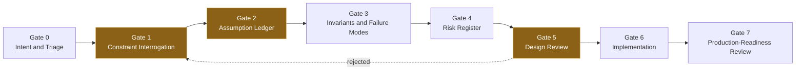
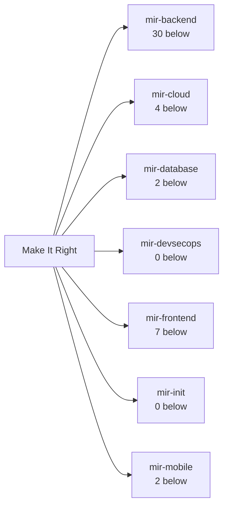
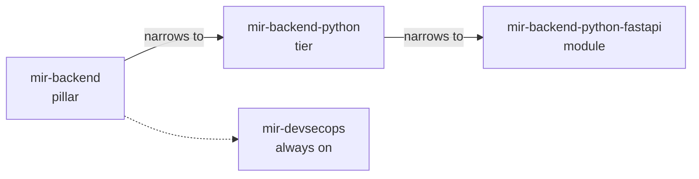
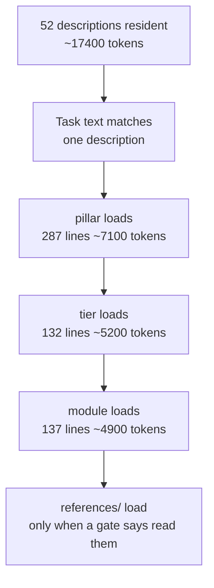
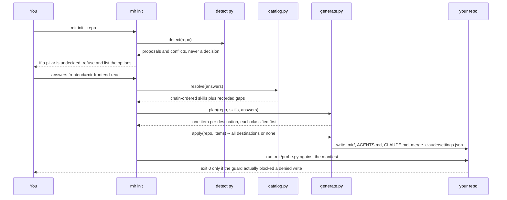
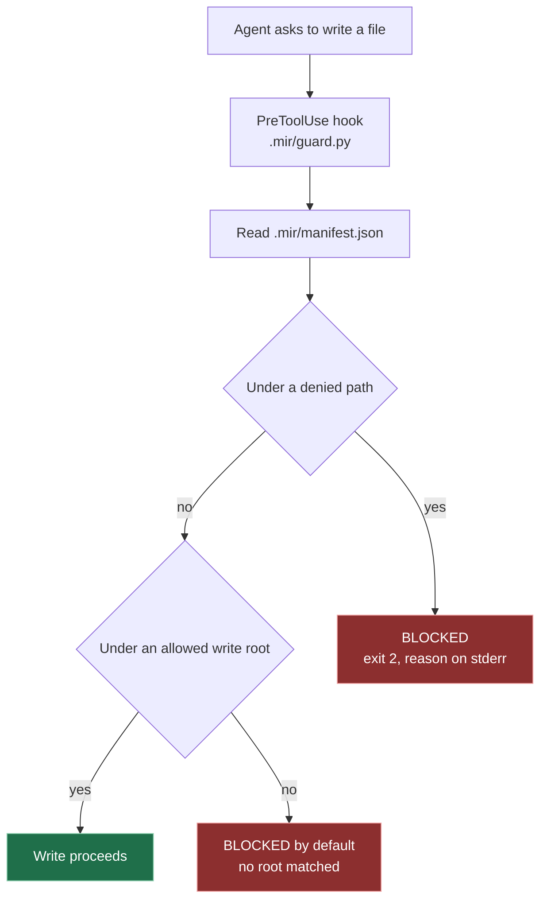

# Make It Right

Make It Right is a repository of engineering skills for AI coding agents. It installs into Claude Code, Cursor, Codex CLI, and Antigravity.

It addresses one failure mode: a model writes code that passes the happy-path test while violating a constraint nobody stated. The skills make the agent discover those constraints, confirm the important assumptions with you, get the design approved, and only then write code. It also generates a per-repository write policy and the hook enforcing it.

Start at the [quickstart](#quickstart). The full skill tree is in [`docs/skill-tree.md`](docs/skill-tree.md); [tool support](#tool-support-at-a-glance) states what each host receives, and [honest limits](#honest-limits) what none of it does.

## Quickstart

Three commands and a restart.

```bash
git clone https://github.com/anantbhandarkar/make-it-right.git ~/src/make-it-right
cd ~/src/make-it-right
./install.sh --tool=claude          # or --tool=cursor|codex|antigravity|all
```

Restart the agent so it indexes the new resources, then describe a task in plain language — "add a checkout endpoint that charges a card and decrements inventory". The matching skills load from their descriptions; you do not name them. Typing `/mir-backend <task>` forces a specific one.

That is the whole install; everything below is optional depth. To also give one repository a write policy and an always-on baseline:

```bash
./bin/mir init /path/to/your/repo --target claude    # or codex, antigravity, cursor, all
```

That writes a baseline, a write policy, a guard, and each named host's hook registration, then attacks its own guard to prove the policy holds — see [Project harness](#project-harness-mir-init). `install.sh` does not put `bin/mir` on `PATH`, so run it by path or alias it.

## Why it exists

A model does not fail at writing code. It fails at knowing which code to write. Pattern completion produces something locally correct that violates a rule nobody wrote down, and a passing test says nothing about that rule.

Consider an order endpoint that charges a card and decrements the last unit of inventory. Locally correct code can charge the card, time out before the client sees the response, get retried without an idempotency key and charge again, race a second request for the same last unit, and email the customer before the transaction commits. Each step looks reasonable alone. The combination is wrong, and nothing in the test suite goes red.

Failures like those are enumerated in the skills in advance, as named classes, each attached to the gate that answers it: retry without deduplication, the half-success states of every external call, a token that says *who* is calling and nothing about whether they may touch *this* row. The pillar makes the agent state invariants, transitions, transaction boundaries, idempotency, and the observability plan before implementation; you confirm and approve; reviewers then read the diff.

**What it costs.** Turns, spent before any code exists: Gate 1 asks up to four questions, Gate 2 needs a confirmed ledger, Gate 5 an approved design, Gate 7 reviews the diff. Context is the second cost: a matching task loads a pillar, a tier, and a module body plus their references, and every installed skill's description is read at session start whether it is relevant or not. That trade pays when a wrong answer is expensive to find in production, and not otherwise.

## When to use it, and when not to

Each pillar's Gate 0 opens with a risk table and drops to `--advisory` when no box ticks. Restated:

**Use it when** the change writes persistent state; money, inventory, quotas, or authorization are involved; the path runs under concurrency or retries; the work spans more than one table or service; an external dependency is in the path, because every one has a half-success state; a migration will run against populated tables; the system is multi-tenant or stores PII; frontend work carries async state or untrusted content; or the delivery path itself changes.

**Do not use it when** it is a one-line fix; the task is read-only or pure compute — `mir-backend` Gate 0 says plainly not to bureaucratize a CSV parser; the component is stateless and presentational; the table is a ten-row lookup; the code is throwaway; or you are exploring rather than building, because the gates want decisions and a spike exists to find out what the decisions are.

Two flags make skipping a stated choice rather than a silent bypass, and neither turns the skill off. `--advisory` lifts the one hard rule — code may be written without a passed Gate 5, and Gate 2 may pass unconfirmed — and nothing else; the pillars invoke it as "proceed lightly", not "stop". `--skip-interrogation` drops the Gate 1 questions, and the ledger is still written from the defaults and still confirmed, because skipping the questions must not skip the record of what was assumed.

## How it works

Two mechanisms ship here and they are not the same thing. **Skill routing** decides which instructions enter the agent's context; it is installed globally by `install.sh`, it takes effect because the model reads a skill body and follows it, and when it fails the agent simply proceeds without the guidance. **The `mir init` harness** decides which paths the agent may write; it is installed per repository for the hosts named by `--target`, it takes effect because a hook returns a blocking verdict before the write happens, and when it fails on its own errors it fails open, allows the call, and says so on stderr.

The guard has no notion of a gate, a ledger, or an approval, and the skills have no notion of the write policy: the harness cannot stop an agent writing code before Gate 5, and the gates cannot stop a write to a denied path. Everything on the routing side is instruction — a model follows it, and nothing here forces it to.

## The eight gates

<!-- mir:gen:begin id=gates src=docs/gen_diagrams.py -->
### The eight gates

Every pillar runs the same eight gates. No implementation code is written before Gate 6, and the three amber gates stop and wait for a human.



Amber nodes are the three `[USER GATE]` stops -- the model must not proceed past them on its own. They are also named as user gates in the text version.

<details>
<summary>Text version -- The eight gates</summary>

1. Gate 0 -- Intent and Triage
2. Gate 1 -- Constraint Interrogation (stops for the user)
3. Gate 2 -- Assumption Ledger (stops for the user)
4. Gate 3 -- Invariants and Failure Modes
5. Gate 4 -- Risk Register
6. Gate 5 -- Design Review (stops for the user)
7. Gate 6 -- Implementation
8. Gate 7 -- Production-Readiness Review

Step 6 can return to step 2 when rejected.

</details>

<details>
<summary>Links -- The eight gates</summary>

- [EXTENDING.md -- what each gate is for](EXTENDING.md)

</details>
<!-- mir:gen:end id=gates -->

Names and artifacts vary by pillar; the ordering and the approval points do not. Three gates stop and wait for you, and the model must not proceed past them on its own: **Gate 1** asks the ranked questions, **Gate 2** needs the assumption ledger confirmed — silence does not approve it — and **Gate 5** needs the design approved. The one hard rule follows: in normal mode no implementation code is written until Gate 5 has passed, application code, DDL, and delivery configuration alike.

## The pillars

<!-- mir:gen:begin id=pillar-map src=docs/gen_diagrams.py -->
### Pillar map

7 pillars, 52 skills in total. A pillar is the coarse gate; it loads on a matching task and hands off to a tier and then a module.



<details>
<summary>Text version -- Pillar map</summary>

- Make It Right
  - mir-backend -- 30 tiers and modules below it
  - mir-cloud -- 4 tiers and modules below it
  - mir-database -- 2 tiers and modules below it
  - mir-devsecops -- 0 tiers and modules below it
  - mir-frontend -- 7 tiers and modules below it
  - mir-init -- 0 tiers and modules below it
  - mir-mobile -- 2 tiers and modules below it

</details>

<details>
<summary>Links -- Pillar map</summary>

- [mir-backend](skills/mir-backend/SKILL.md) -- Backend / API
- [mir-cloud](skills/mir-cloud/SKILL.md) -- Cloud / infra
- [mir-database](skills/mir-database/SKILL.md) -- Database
- [mir-devsecops](skills/mir-devsecops/SKILL.md) -- DevSecOps (always on)
- [mir-frontend](skills/mir-frontend/SKILL.md) -- Web frontend
- [mir-init](skills/mir-init/SKILL.md)
- [mir-mobile](skills/mir-mobile/SKILL.md) -- Native mobile

</details>
<!-- mir:gen:end id=pillar-map -->

The gated pillars run the same eight gates but do not produce the same design artifacts. `mir-backend` emphasizes transaction boundaries, idempotency, external calls, concurrency, ownership, and tenancy. `mir-frontend` emphasizes interaction contracts, UI state machines, state and rendering ownership, accessibility, and performance budgets — its middle tier is a reactivity library, not a runtime. `mir-database` emphasizes the database-versus-application enforcement boundary, nullability, cardinality, and expand/contract migration phases. `mir-mobile` emphasizes process death, storage and reinstall semantics, background execution, and store rules. `mir-devsecops` emphasizes trust ledgers, untrusted-input paths, dependency controls, and whether each control blocks or only warns.

`mir-cloud` decides differently on purpose: Gate 3 eliminates providers on hard constraints — a missing region, a duration limit, an incompatible state model — only the survivors are scored, and Gate 5 has to carry a dated cost model with egress, idle cost, residency, and exit cost. A provider is never named from familiarity and justified afterwards. `mir-init` is the seventh pillar and is the [project harness](#project-harness-mir-init) rather than a gated pipeline.

## Skill selection and the three-tier chain

Hosts scan `skills/` one level deep, so the directory name encodes the hierarchy: `mir-<pillar>`, `mir-<pillar>-<runtime>`, `mir-<pillar>-<runtime>-<framework>`. `validate.py` treats a name whose parent chain does not exist as an error.

<!-- mir:gen:begin id=chain-example src=docs/gen_diagrams.py -->
### Coarse to fine, worked

`catalog.resolve()` turns one answer into this chain, ordered coarse to fine, so the general constraints are in context before the framework mechanics are.



<details>
<summary>Text version -- Coarse to fine, worked</summary>

- mir-backend -- the pillar
  - narrows to: mir-backend-python -- the tier
    - narrows to: mir-backend-python-fastapi -- the module
  - mir-devsecops -- resolved for every stack, never a question

</details>

<details>
<summary>Links -- Coarse to fine, worked</summary>

- [mir-backend](skills/mir-backend/SKILL.md) -- Backend / API
- [mir-backend-python](skills/mir-backend-python/SKILL.md) -- Python (framework not chosen)
- [mir-backend-python-fastapi](skills/mir-backend-python-fastapi/SKILL.md) -- Python + FastAPI
- [mir-devsecops](skills/mir-devsecops/SKILL.md) -- DevSecOps (always on)

</details>
<!-- mir:gen:end id=chain-example -->

**Rule 1: the description is the router.** At index time the agent sees only a skill's `name` and `description`, so that description *is* the routing logic. Every one states both clauses:

```text
TRIGGER <the stacks and tasks that should load this skill>.
SKIP    <the adjacent stacks and tasks that should not load it>.
```

`mir-backend` triggers for state-changing backend work in any language and skips frontend, read-only work, and standalone schema work; `mir-backend-python-fastapi` triggers only for FastAPI. These clauses decide which bodies enter the context, so `validate.py` makes both mandatory. In the chain above, exactly three bodies load; every other skill contributes its description and nothing else.

## Progressive disclosure and token cost

<!-- mir:gen:begin id=disclosure src=docs/gen_diagrams.py -->
### Progressive disclosure and what it costs

Nothing below the first box is in context until it is earned. The token figures are measured from the files on disk at generation time, not estimated.



<details>
<summary>Text version -- Progressive disclosure and what it costs</summary>

1. Host idle -- all 52 skill descriptions are resident, about 17400 tokens
2. A task arrives whose wording matches one description's TRIGGER clause
3. mir-backend loads whole -- pillar, 287 body lines, about 7100 tokens
4. mir-backend-python loads whole -- tier, 132 body lines, about 5200 tokens
5. mir-backend-python-fastapi loads whole -- module, 137 body lines, about 4900 tokens
6. reference files load last, and only when a gate tells the model to read one

</details>

<details>
<summary>Links -- Progressive disclosure and what it costs</summary>

- [mir-backend](skills/mir-backend/SKILL.md) -- pillar, 287 body lines
- [mir-backend-python](skills/mir-backend-python/SKILL.md) -- tier, 132 body lines
- [mir-backend-python-fastapi](skills/mir-backend-python-fastapi/SKILL.md) -- module, 137 body lines

</details>
<!-- mir:gen:end id=disclosure -->

Everything below the descriptions is earned, which is why `validate.py` warns above 380 body lines: a body loads whole, and adding a skill grows only the index.

## The inventory

The full tree — every pillar, tier, and module with its label and its place in the chain — is in [`docs/skill-tree.md`](docs/skill-tree.md), generated from `init/catalog.py`, the same module `mir init` resolves against, and re-derived by `validate.py` on every run. This README quotes no skill count on purpose: three documents here once disagreed about how many skills existed, because three people counted by hand at three different times. Run `./validate.py` for the current numbers.

## Reviewer sub-agents

All six files under `agents/` are read-only: they report severity-tagged findings with file and line references and a fix, and the orchestrating agent still asks you, changes the code, and verifies it, reading the flagged diff rather than relaying a reviewer's summary as fact. `constraint-interrogator` proposes the Gate 1 questions without speaking to you or writing code. At Gate 7, `reliability-reviewer` and `security-reviewer` run on every gated pillar, `migration-reviewer` only when migrations changed, and `a11y-reviewer` and `frontend-perf-reviewer` on frontend and mobile work.

## Validation

This repository once shipped a Gate 5 instruction pointing at a skill that had never been written, and nothing caught it: a host that cannot resolve a skill name loads no content and reports no error.

```bash
./validate.py            # errors, warnings, and the summary
./validate.py --quiet    # error lines plus the summary
./validate.py --json     # machine-readable stats and problems
```

It exits `0` with no errors — warnings are allowed — `1` on any error, and `2` when `skills/` cannot be read at all, and `install.sh` refuses to install on any error. Every problem line carries a code, so a failure names the rule it broke rather than describing it. The errors are the ones that would ship a skill nothing can load: a broken frontmatter contract, a description missing its `TRIGGER` or `SKIP` clause, a body with no Security heading, and any parent prefix, reference, or dispatched `subagent_type` resolving to nothing on disk.

Every Mermaid block in this README and in `docs/skill-tree.md` sits between `mir:gen` markers and is generated from the catalog. Editing one by hand is pointless — it gets overwritten — and drift is an error, so a stale diagram blocks installation through the gate that already exists:

```bash
python3 docs/gen_diagrams.py --check    # what drifted, as a diff; writes nothing
python3 docs/gen_diagrams.py --write    # regenerate every block, in place
```

## Tool support at a glance

The four hosts do not receive the same thing. This is what `install.sh` and `mir init` deliver today, so the asymmetry is visible before you rely on it:

| Capability | Claude Code | Cursor | Codex CLI | Antigravity |
|---|---|---|---|---|
| Skills linked by `install.sh` | `~/.claude/skills` | The same `~/.claude/skills` links, read only while the third-party toggle is on | `$CODEX_HOME/skills` (default `~/.codex/skills`) | `~/.gemini/config/skills` |
| Reviewer sub-agents linked | `~/.claude/agents` | The same `~/.claude/agents` files | No — Codex has no directory for standalone agents; checklists run inline | None installed; checklists run inline |
| Always-on `AGENTS.md` | Not linked globally; `mir init` writes a per-repo one | The same per-repo one | `~/.codex/AGENTS.md` | `~/.gemini/AGENTS.md` |
| Hook registration from `mir init` | `.claude/settings.json` | None, by design | `.codex/hooks.json` | `.agents/hooks.json` |
| Write policy | **Enforced** — the guard decides and the registration is verified | **Conditional** — see below | **Unverified** — the file is emitted; the invocation is not proven | **Unverified** — the file is emitted; the invocation is not proven |

**Cursor is conditional, which is neither yes nor no.** Cursor can load Claude Code's hooks from `.claude/settings.json` and honours exit code `2` as a block, but only when *Include third-party Plugins, Skills, and other configs* is enabled in Settings → Rules, Skills, Subagents. That setting is off until a human turns it on, it is per user rather than per repository, and `mir init` can neither detect it nor report it. Everything Cursor gets sits behind it, and this repository does not test against Cursor. So `mir init` deliberately writes **no** Cursor-specific file: a path emitted where nothing reads it is a defect this repository has already shipped once, and a harness that is present and inert is harder to document honestly than one that is absent.

**Codex and Antigravity get a harness whose invocation is unverified.** The hook file is emitted, and the probe proves the guard decides that manifest correctly on each host's own verdict channel and that the registration names it. **No command in this repository proves that either host actually invokes that file.** The truthful claim is "emits a Codex harness whose invocation is unverified", not "supports Codex"; `.mir/COVERAGE.md` names the manual procedure that would settle it, per host. Antigravity additionally fails open on its own side, which is why its adapter is fail-closed inside itself and emits deny-JSON even when it crashes.

## Installation

`install.sh` creates symlinks, not copies, so repository edits reach the installed host as soon as it reloads. It runs `validate.py --quiet` first and any non-zero result stops the install, and it never replaces a non-symlink target. `CLAUDE_HOME`, `CODEX_HOME`, and `GEMINI_HOME` override the paths above.

```bash
./install.sh                     # same as --tool=claude
./install.sh --tool=cursor       # uses Claude's directories
./install.sh --tool=codex
./install.sh --tool=antigravity
./install.sh --tool=all          # Claude, Codex, Antigravity
```

The paths in that table were probed, not assumed: a link in a directory nothing reads is this repository's own failure mode, one layer down.

### Scope, and keeping the install in sync

`--scope` combines with `--tool`: `--scope=all`, the default, links every skill, and `--scope=pillars` links only the depth-1 slugs. The reason to care is the index — a host reads every installed skill's `name` and `description` at session start, in every repository, relevant or not. Bodies stay lazy; the index does not. So install the pillar floor once and let each repository top itself up:

```bash
./install.sh --tool=claude --scope=pillars   # once: every repo gets the gates
./bin/mir init /path/to/repo --install       # per repo: that repo's tiers and modules
./install.sh --tool=all --prune              # upgrade: drop this checkout's stale links first
./install.sh --tool=all --prune-only         # uninstall
```

`mir init --install` symlinks the resolved tiers and modules into each selected host's project skill directory — `<repo>/.claude/skills/` for Claude Code, `<repo>/.agents/skills/` for Antigravity — and removes `mir-*` links the current stack no longer resolves. Codex and Cursor have no project-local skills directory, so `--install` writes nothing for them, and a repository that never runs `mir init` still gets the pillar gates: fewer skills, not none.

`--prune` matters on upgrade because installing is `ln -sfn`, which overwrites but never removes: a renamed skill otherwise leaves a link resolving to nothing, and `validate.py` cannot see it, because it validates the repository rather than your `$HOME`.

## Project harness (`mir init`)

`install.sh` puts skills on the machine. `mir init` prepares one repository: it records the confirmed stack, writes a thin always-on baseline, and generates a write policy plus the hooks that enforce it. It installs no software and writes no application code, because an agent that installs software is what a containment harness exists to stop.

<!-- mir:gen:begin id=init-flow src=docs/gen_diagrams.py -->
### What `mir init` actually does

Detection proposes and never decides, and the run is all-or-nothing: a harness that is half-installed looks installed and enforces nothing.



<details>
<summary>Text version -- What `mir init` actually does</summary>

1. You calls mir init (init/cli.py): mir init --repo .
2. mir init (init/cli.py) calls init/detect.py: detect(repo)
3. init/detect.py replies to mir init (init/cli.py): proposals and conflicts, never a decision
4. mir init (init/cli.py) replies to You: if a pillar is undecided, refuse and list the options
5. You calls mir init (init/cli.py): --answers frontend=mir-frontend-react
6. mir init (init/cli.py) calls init/catalog.py: resolve(answers)
7. init/catalog.py replies to mir init (init/cli.py): chain-ordered skills plus recorded gaps
8. mir init (init/cli.py) calls init/generate.py: plan(repo, skills, answers)
9. init/generate.py replies to mir init (init/cli.py): one item per destination, each classified first
10. mir init (init/cli.py) calls init/generate.py: apply(repo, items) -- all destinations or none
11. init/generate.py calls your repository: write .mir/, AGENTS.md, CLAUDE.md, merge .claude/settings.json
12. mir init (init/cli.py) calls your repository: run .mir/probe.py against the manifest
13. your repository replies to You: exit 0 only if the guard actually blocked a denied write

</details>

<details>
<summary>Links -- What `mir init` actually does</summary>

- [init/cli.py](init/cli.py) -- the flow above, in order
- [init/detect.py](init/detect.py) -- proposes, never decides
- [init/generate.py](init/generate.py) -- classifies every destination before writing

</details>
<!-- mir:gen:end id=init-flow -->

Detection proposes with a stated reason and a confidence, and never decides. The picker that confirms it is presented by the `/mir-init` skill, because `init/cli.py` never prompts — it refuses. If a pillar collected more than one candidate, or a detected stack has no skill, the run stops with exit `3` and hands you a paste-ready `--answers` stub. A guessed stack loads the wrong gates, which is worse than no gates, because it reads as verified. `mir-devsecops` is always resolved, so security is not opt-in.

```bash
python3 init/cli.py init .                                          # five steps, Claude Code
python3 init/cli.py init . --target all                             # every host
python3 init/cli.py init . --dry-run                                # print the plan, write nothing
python3 init/cli.py init . --answers answers.json --noninteractive  # scripted, no picker
python3 .mir/probe.py --repo .                                      # re-check a harness
```

`--noninteractive` does not mean "fail on ambiguity" — ambiguity is a hard stop in both modes, because it is yours to resolve either way, and the only thing a flag could change is whether mir admits it resolved it for you. There is deliberately no `--accept-detection`: a "just guess" flag re-creates the defect behind an approving name.

### `--target`: which hosts get a harness

`--target` takes a comma-separated list of `claude`, `codex`, `antigravity`, `cursor`, or `all`, and defaults to `claude`. An unknown name is **refused**, never dropped: `--target codx` must not quietly produce a Claude-only harness you believe covers Codex.

| `--target` | Enforcement file | Verdict channel | Level |
|---|---|---|---|
| `claude` | `.claude/settings.json`, merged not overwritten | exit code; `2` blocks, reason on stderr | Enforced |
| `codex` | `.codex/hooks.json` | exit code; `2` blocks. `ask` is never returned, because Codex continues past a decision it does not support | Unverified |
| `antigravity` | `.agents/hooks.json` | stdout JSON; a deny is `{"decision": "deny"}` with **exit 0**, because the host ignores the exit code | Unverified |
| `cursor` | none, by design | Claude Code's, if the user enabled the third-party toggle | Advisory |

Each hook command carries `--protocol <host>` so the guard answers on that host's channel, which is load-bearing rather than cosmetic: a guard answering every host with an exit code would have every Antigravity block read as an allow. The selected set is written into the manifest, and the probe reads the declared targets **from the manifest, not from flags** — so a target cannot be dropped from verification by re-running the probe with narrower arguments, and a declared target whose wiring file was deleted is a finding rather than a skip.

### What it writes

| File | What it is |
|---|---|
| `AGENTS.md` | The thin baseline: the pillars that apply here, the hard rule, the recorded stack. Never skill content. |
| `CLAUDE.md` | An `@AGENTS.md` import plus room for repository notes. |
| `.mir/manifest.json` | The write policy: allowed roots, denied paths, recorded stack, resolved skills, declared targets. |
| `.mir/guard.py` | The `PreToolUse` hook that enforces the manifest. It lives under `.mir/`, itself denied, so the agent cannot rewrite the guard to widen its own permissions. |
| `.mir/probe.py` | The manifest-derived verifier, so anyone can re-check the harness later. |
| `.mir/COVERAGE.md` | What each declared host enforces, and what was not proven about it. |
| Hook registration | One per selected target, and none for `cursor`. |

Both Markdown files carry an ownership marker: everything above it regenerates, everything you write below it survives a re-run. Re-running **reconciles** rather than merely detecting — a stale matcher or command is rewritten instead of being left alone because the tag was present. Every destination is inspected before any is written, and the whole run is refused if one is a symlink, is not a regular file, will not parse, or carries no ownership marker. Generation is all-or-nothing, because a partial harness is worse than none: it looks installed.

### `.mir/COVERAGE.md`, and why it opens with a verdict

`COVERAGE.md` opens with a three-line verdict block rather than with its table, and the ordering is the argument: a table invites you to find your own row and stop, so the block states what is enforced, what is merely emitted, and what is not enforced at all before anyone reaches the cell they were hoping for.

```text
ENFORCED   (guard decides, host hook registered): claude
UNVERIFIED (hook file emitted, host invocation not proven): antigravity, codex
ADVISORY ONLY — the manifest is NOT enforced for: cursor
```

Below it sits one row per host per capability, each carrying the mechanism, its source, what the probe proved, **what the probe did not prove**, and the manual command that would settle it. For an unverified host that last pair is the whole finding, and a row without it reads as coverage.

### Manifest version 2, and an existing `.mir/`

`.mir/manifest.json` carries `mir_manifest_version`, now `2`. The bump buys one thing, the `targets` block, and it breaks any repository holding a harness generated before it.

The guard carries the version it understands as a constant and compares it against the manifest's. **On a mismatch it complains on stderr on every invocation and allows the write, unchecked, on every protocol.** That is deliberate: a frozen guard cannot know what a newer manifest means, and refusing every write would brick an agent inside a repository whose policy is valid. Runtime fails open; verification fails closed, which is the probe's job. So an old `.mir/` does not error — it stops enforcing, on a channel you may not be reading. **Re-run `mir init` after upgrading**, and restart the agent: Claude Code snapshots hooks at session start, so a fresh settings file does not protect the session that wrote it.

### The probe, and its four exit codes

The probe reads the manifest and attacks the guard with every denied path, a path just inside each, instantiations of every denied pattern, one allowed path per root as a positive control, and the manifest and guard themselves. It never opens or writes an attack path — an attack is a JSON event piped to the guard and a judgment on the answer — which is what makes it safe to fire paths under your real home directory. Two further phases cover what the attacks cannot: **version** compares the guard's constant against the manifest's, and **wiring** checks each declared target's registration, since every attack calls the guard directly and would say `BLOCK` behind a stale matcher.

| Code | Meaning |
|---|---|
| `0` | Clean. |
| `1` | **Leak.** A denied path reached the target: the guard allowed it, the hook is not registered for the tool that would write it, a declared target's wiring file is missing, the guard and manifest versions disagree (so the guard allows everything unchecked), or a registered command carries no `--protocol` and is therefore the pre-v2 command. |
| `2` | The probe could not run: no manifest, or no guard. Not a passing harness, an unchecked one. |
| `3` | **Inconclusive.** A positive control was blocked, the guard answered on a channel this host does not read, the guard declares no version at all, or the wiring could not be confirmed. |

Exit `3` exists because a guard that blocks everything is not simply "too tight": with the positive control blocked, every `BLOCK` row becomes undiscriminating — you cannot tell "blocked because denied" from "blocked because broken" — and a green report built from uninformative rows is laundering. Pass `--allow-false-blocks` when the over-tightening is deliberate; it never silences a leak. A guard that declares **no** version is `3` rather than `1` for the mirrored reason: nothing was proven either way, and naming a leak the run did not find is the same laundering pointed backwards.

### What the guard actually covers

<!-- mir:gen:begin id=trust-boundary src=docs/gen_diagrams.py -->
### The write policy, end to end

Deny by default, and denied paths beat allowed roots. The policy, the guard and the probe all live under `.mir/`, which is itself denied, so an agent cannot widen its own permissions.



Red nodes are refusals and the green node is the only path that writes. Both outcomes are spelled out in words in the text version.

<details>
<summary>Text version -- The write policy, end to end</summary>

- An agent asks to write a file
  - The PreToolUse hook runs .mir/guard.py
    - The guard reads .mir/manifest.json
      - Is the target under a denied path (secrets, .git, .mir, the hook registration, home config)
        - yes: BLOCKED -- denied paths win over allowed roots
        - no: Is the target under an allowed write root
          - yes: ALLOWED -- the write proceeds
          - no: BLOCKED -- deny by default, nothing outside an allowed root is writable

</details>

<details>
<summary>Links -- The write policy, end to end</summary>

- [init/schema.py](init/schema.py) -- the baseline denied set, with the reason for each
- [init/guard.py](init/guard.py) -- the hook that decides
- [init/probe.py](init/probe.py) -- proves the guard really blocks

</details>
<!-- mir:gen:end id=trust-boundary -->

`.git`, `.mir`, `.claude/settings.json`, `.codex`, `.agents`, `**/.env*`, and the SSH, cloud, kube and agent-tool config directories under `$HOME` are denied by default; the policy protecting itself is asserted by the probe, not assumed. `.agents` is denied wholesale and `mir init` can still write `.agents/hooks.json`, because the generator runs outside the agent's tool loop. A glob entry matches at any depth, which is what `**/.env*` needs to cover `src/.env` rather than only the root file.

Tool coverage is partial by construction, and the guard says so rather than implying more. `Write`, `Edit`, `MultiEdit`, `NotebookEdit`, and `Update` are **full**, because the target is a structured path field. `Bash` is **partial**: the target sits inside a shell string, so the guard tokenises each segment and reads the destination per verb — redirects, `tee`, `dd of=`, `cp`/`mv`/`install` — and what a tokeniser cannot see is listed in the guard's own header, from `eval` and `$(...)` indirection to `sed -i`, which writes a file it never names. MCP tool writes are **not parsed at all**. Codex `apply_patch` bodies are parsed for their own file headers, and one that will not parse is denied rather than queried.

So a clean run proves the guard enforces the paths the probe tested, and nothing about the ones it did not — the report prints both lists for that reason. The guard also fails open on its own errors: a missing or unparseable manifest allows the call and says so on stderr, because a policy that bricks the agent when it has a bug is worse than one that is honest about not being loaded.

## Extending the repository

Read [EXTENDING.md](EXTENDING.md) before adding a skill — it carries the placement test, the naming convention, the size budgets, and copy-and-edit recipes, and [`docs/skill-tree.md`](docs/skill-tree.md) carries the placement decision as a diagram. See the [Changelog](CHANGELOG.md) and [RELEASING.md](RELEASING.md) for what changed and how a release is cut.

The rule underneath all of it: a rule belongs at the lowest tier where it stays true for every task that should receive it, so do not widen a higher tier because one framework has a problem. Whatever the level, match `name` and `trigger` to the directory, write exact `TRIGGER` and `SKIP` clauses, and keep the Security section — `validate.py` requires one in every body, because security is not a backend-only concern.

## Honest limits

- This does not make model output deterministic. It makes skill selection more controlled through names and `TRIGGER`/`SKIP` text. The model can still misunderstand a confirmed requirement or write a defective implementation.
- The generated harness is enforced on Claude Code, emitted-but-unverified on Codex CLI and Antigravity, and conditional on Cursor. Read `.mir/COVERAGE.md` before treating any of the last three as containment.
- Guidance ages. Framework versions, advisories, cloud prices, and store rules change, and the skills cite dated `CVE`, `GHSA`, and `RUSTSEC` identifiers rather than permanent guarantees. Run a currency pass before relying on one.
- Published evidence on structured guidance shows that strong models improve at least as much as weak ones. This is a quality tool, not a way to make a cheap model equal an expensive one.
- The skills do not replace tests, telemetry, human design approval, a migration rehearsal, a threat review, or provider pricing verification.

## License

Licensed under the [Apache License 2.0](LICENSE).
