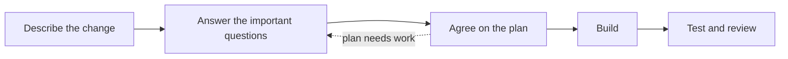
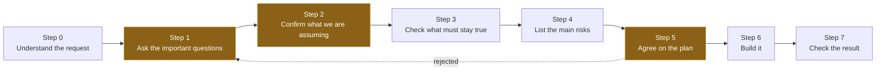
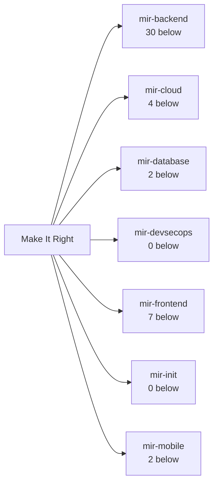
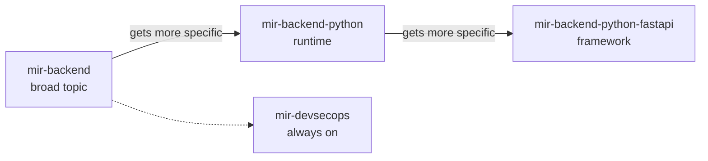
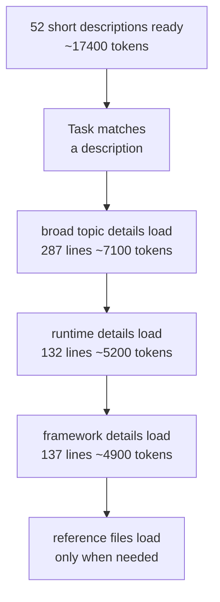
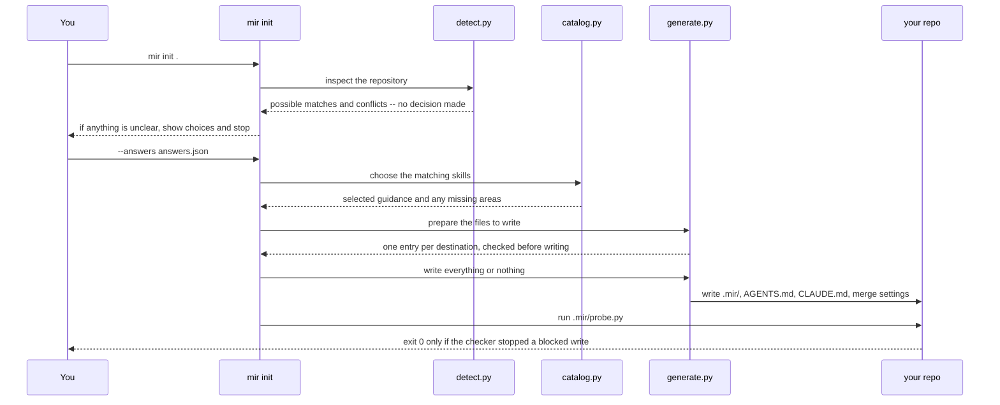
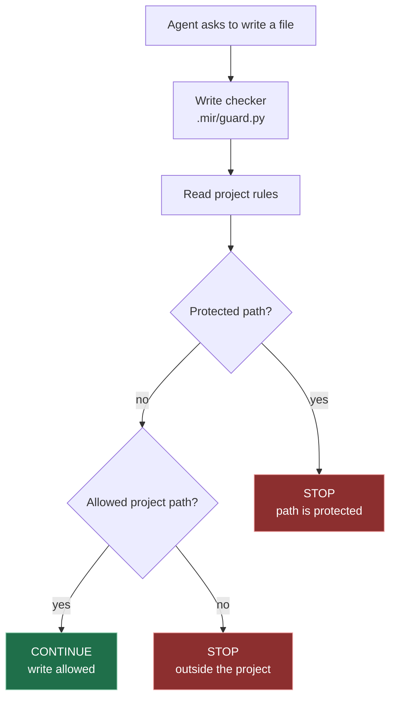

# Make It Right

<div align="center">

**A practical safety layer for AI coding agents.**

[What it does](#what-it-does) · [How it works](#how-it-works) · [Quick start](#quick-start) · [Project setup](#protect-one-project)

</div>

| License | Install | Agent hosts |
|---|---|---|
| MIT | Bash installer; Python 3 for checks | Claude Code · Codex CLI · Antigravity · Cursor* |

\* The installer can prepare each host, but write protection depends on the host. See [support](#supported-hosts).

Make It Right helps an AI coding agent pause before a risky change. It asks for missing context, confirms the plan, loads guidance for the stack, and can prevent writes outside approved project paths.

It is a small library of reusable skills, reviewer checklists, and a per-project setup command called `mir init`.

## Contents

| Start here | Use it | Reference |
|---|---|---|
| [What it does](#what-it-does) | [Quick start](#quick-start) | [What it covers](#what-it-covers) |
| [What problem it solves](#what-problem-it-solves) | [Project setup](#protect-one-project) | [How guidance is chosen](#how-guidance-is-chosen) |
| [How it works](#how-it-works) | [Validate](#validate) | [Limits](#limits) |
| [Supported hosts](#supported-hosts) | [Learn more](#learn-more) | [License](#license) |

## What it does

| Part | In simple terms |
|---|---|
| Conversation before coding | Asks the few questions that can change the solution, then confirms what everyone is assuming. |
| Guidance for the right stack | Picks the broad engineering area, runtime, and framework guidance that match the task. |
| Optional project write guard | Stops an agent from writing to protected paths or outside the project paths you approve. |
| Checks for the repository | Verifies the skill tree, generated diagrams, setup files, and write guard. |

You can use the skills without the project guard. You can also add the guard only to projects that need it.

## What problem it solves

AI agents can write code that looks correct while missing an important rule. Make It Right turns those rules into a short, repeatable workflow.

| Common request | What can go wrong | What Make It Right asks or checks |
|---|---|---|
| “Make payments retry-safe” | A retry charges the customer twice. | What happens when the same request is repeated? What proves it runs only once? |
| “Change a database table” | A deploy locks the table or loses data. | How large is the table? Can the change be rolled back safely? |
| “Add a user endpoint” | One user can read another user’s record. | Who is the user, and what gives them permission to see this record? |
| “Update stock after checkout” | Two requests sell the same last item. | What happens when requests arrive at the same time? |
| “Let the agent edit the project” | The agent changes secrets, hooks, or its own rules. | Which paths may it write, and which paths must always be protected? |

The result is not a promise that every change is safe. It is a clearer conversation, better-matched guidance, and—when enabled—a real file-path check.

## How it works

The main workflow is easy to summarize:



The highlighted steps below pause for your input. The agent should not quietly fill in an important blank.

<!-- mir:gen:begin id=gates src=docs/gen_diagrams.py -->
### The eight steps

Every task follows the same eight steps. The three highlighted steps pause for your input, and the agent does not build before Step 6.



Highlighted steps pause for your input. The agent must not move past them on its own.

<details>
<summary>Text version -- The eight steps</summary>

1. Step 0 -- Understand the request
2. Step 1 -- Ask the important questions (pauses for your input)
3. Step 2 -- Confirm what we are assuming (pauses for your input)
4. Step 3 -- Check what must stay true
5. Step 4 -- List the main risks
6. Step 5 -- Agree on the plan (pauses for your input)
7. Step 6 -- Build it
8. Step 7 -- Check the result

Step 5 can return to Step 1 when rejected.

</details>

<details>
<summary>Links -- The eight steps</summary>

- [EXTENDING.md -- what each step does](EXTENDING.md)

</details>
<!-- mir:gen:end id=gates -->

## Supported hosts

The installer targets four coding-agent hosts. A generated hook file is not the same as proof that a host will call it.

| Host | What gets installed | Write protection |
|---|---|---|
| Claude Code | Skills, reviewer files, and project hook settings | Enforced and verified by the project probe |
| Codex CLI | Skills and a project hook file | Hook file is created; host invocation is not proven |
| Antigravity | Skills and a project hook file | Hook file is created; host invocation is not proven |
| Cursor | Claude resources when its third-party configuration toggle is on | Advisory only; no Cursor-specific hook is emitted |

`install.sh --tool=all` installs Claude Code, Codex CLI, and Antigravity. Cursor needs its own toggle and is not included in `all`.

## What it covers

| Area | Useful for | Skill family |
|---|---|---|
| Server and APIs | State changes, retries, concurrency, permissions, and external services | [`mir-backend`](skills/mir-backend/SKILL.md) |
| Cloud and infrastructure | Provider choices, access, cost, and exit plans | [`mir-cloud`](skills/mir-cloud/SKILL.md) |
| Databases | Tables, indexes, consistency, and safe structure changes | [`mir-database`](skills/mir-database/SKILL.md) |
| Security and delivery | Secrets, dependencies, untrusted input, and releases | [`mir-devsecops`](skills/mir-devsecops/SKILL.md) |
| Web applications | UI state, rendering, accessibility, and speed | [`mir-frontend`](skills/mir-frontend/SKILL.md) |
| Mobile applications | App lifecycle, storage, background work, and store rules | [`mir-mobile`](skills/mir-mobile/SKILL.md) |
| Project setup | Detecting a stack and creating the optional write guard | [`mir-init`](skills/mir-init/SKILL.md) |

<details>
<summary>Open the visual map of all areas</summary>

<!-- mir:gen:begin id=pillar-map src=docs/gen_diagrams.py -->
### The seven areas

7 broad areas, 52 skills in total. A task starts with the matching area and can then add runtime and framework guidance.



<details>
<summary>Text version -- The seven areas</summary>

- Make It Right
  - mir-backend -- 30 more specific skills below it
  - mir-cloud -- 4 more specific skills below it
  - mir-database -- 2 more specific skills below it
  - mir-devsecops -- 0 more specific skills below it
  - mir-frontend -- 7 more specific skills below it
  - mir-init -- 0 more specific skills below it
  - mir-mobile -- 2 more specific skills below it

</details>

<details>
<summary>Links -- The seven areas</summary>

- [mir-backend](skills/mir-backend/SKILL.md) -- Backend / API
- [mir-cloud](skills/mir-cloud/SKILL.md) -- Cloud / infra
- [mir-database](skills/mir-database/SKILL.md) -- Database
- [mir-devsecops](skills/mir-devsecops/SKILL.md) -- DevSecOps (always on)
- [mir-frontend](skills/mir-frontend/SKILL.md) -- Web frontend
- [mir-init](skills/mir-init/SKILL.md)
- [mir-mobile](skills/mir-mobile/SKILL.md) -- Native mobile

</details>
<!-- mir:gen:end id=pillar-map -->

</details>

## How guidance is chosen

A task gets general guidance first, then more specific guidance:

| Level | Meaning | Example |
|---|---|---|
| Broad topic | The engineering area | Backend / API |
| Runtime | How the code runs | Python |
| Framework | The framework or library | FastAPI |

For a FastAPI task, the agent receives backend, Python, and FastAPI guidance. Security and delivery guidance is included for every stack.

<details>
<summary>Open the FastAPI routing example</summary>

<!-- mir:gen:begin id=chain-example src=docs/gen_diagrams.py -->
### A routing example

The catalog chooses the broad topic, then the runtime, then the framework. That gives the agent general guidance before stack-specific details.



<details>
<summary>Text version -- A routing example</summary>

- mir-backend -- the broad topic
  - gets more specific: mir-backend-python -- the runtime
    - gets more specific: mir-backend-python-fastapi -- the framework
  - mir-devsecops -- included for every stack

</details>

<details>
<summary>Links -- A routing example</summary>

- [mir-backend](skills/mir-backend/SKILL.md) -- Backend / API
- [mir-backend-python](skills/mir-backend-python/SKILL.md) -- Python (framework not chosen)
- [mir-backend-python-fastapi](skills/mir-backend-python-fastapi/SKILL.md) -- Python + FastAPI
- [mir-devsecops](skills/mir-devsecops/SKILL.md) -- DevSecOps (always on)

</details>
<!-- mir:gen:end id=chain-example -->

</details>

## How instructions are loaded

The host does not load every long document for every task.

| When | What the agent sees |
|---|---|---|
| Before a task matches | Short descriptions used to find relevant guidance |
| After a match | Full guidance for the matching area, runtime, and framework |
| Only when needed | Reference files for the specific question |

This keeps unrelated framework details out of the active conversation.

<details>
<summary>Open the context-loading diagram</summary>

<!-- mir:gen:begin id=disclosure src=docs/gen_diagrams.py -->
### How instructions are loaded

The host sees short descriptions first. It loads full guidance only after a task matches it. Token figures come from the files on disk when this diagram is built.



<details>
<summary>Text version -- How instructions are loaded</summary>

1. No task is running -- the host keeps 52 short skill descriptions ready, about 17400 tokens
2. A task arrives whose wording matches a skill description
3. mir-backend loads in full -- broad topic, 287 body lines, about 7100 tokens
4. mir-backend-python loads in full -- runtime, 132 body lines, about 5200 tokens
5. mir-backend-python-fastapi loads in full -- framework, 137 body lines, about 4900 tokens
6. reference files load last, only when the task needs one

</details>

<details>
<summary>Links -- How instructions are loaded</summary>

- [mir-backend](skills/mir-backend/SKILL.md) -- broad topic, 287 body lines
- [mir-backend-python](skills/mir-backend-python/SKILL.md) -- runtime, 132 body lines
- [mir-backend-python-fastapi](skills/mir-backend-python-fastapi/SKILL.md) -- framework, 137 body lines

</details>
<!-- mir:gen:end id=disclosure -->

</details>

## Quick start

### Requirements

- Bash
- Git, if you are cloning the repository
- Python 3 for validation and diagram checks

### Install

```bash
git clone https://github.com/anantbhandarkar/make-it-right.git ~/src/make-it-right
cd ~/src/make-it-right
./install.sh --tool=claude
```

Reload the coding-agent host after installation. Then describe the work you want done in plain language.

Choose another host with one of these commands:

```bash
./install.sh --tool=codex
./install.sh --tool=antigravity
./install.sh --tool=all
```

Use `--tool=cursor` only when Cursor is configured to read third-party skills and configuration.

### Install options

| Command | Use |
|---|---|
| `./install.sh --scope=all` | Install every skill. This is the default. |
| `./install.sh --scope=pillars` | Install only the seven broad areas globally. |
| `./install.sh --prune --dry-run` | Preview stale links without changing your home directory. |
| `./install.sh --prune-only` | Remove only links this checkout can prove it owns. |
| `CLAUDE_HOME=... CODEX_HOME=... GEMINI_HOME=... ./install.sh` | Use different host directories. |

The installer creates symlinks, so edits in this checkout are visible after the host reloads. A normal install does not remove old links. Use pruning deliberately.

## Protect one project

Use `mir init` when one repository needs its own stack-specific guidance and a write boundary.

```bash
./bin/mir init /path/to/repo --target claude
```

`mir init` installs no software and does not change application code. It:

1. Looks at the repository and suggests possible matches.
2. Stops if the repository is unclear instead of guessing.
3. Writes the complete setup or writes nothing.
4. Runs a probe to test the write checker.

Preview or answer the choices yourself:

```bash
./bin/mir init . --dry-run
./bin/mir init . --answers answers.json --noninteractive
```

Example `answers.json`:

```json
{
  "backend": "mir-backend-python-fastapi",
  "database": "mir-database-postgres"
}
```

Use `--install` when the selected runtime and framework skills should also be installed for that project. Use `--target=all` to prepare every supported target.

### Files created in the project

| Path | What it is |
|---|---|
| `AGENTS.md` | Short project rules and the selected stack |
| `CLAUDE.md` | Host-facing pointer to `AGENTS.md` |
| `.mir/manifest.json` | The project paths that are allowed or protected |
| `.mir/guard.py` | The checker that approves or stops a file write |
| `.mir/probe.py` | A test that tries allowed and blocked writes |
| `.mir/COVERAGE.md` | What the probe proved for each target |
| Host hook file | Connects the host to the checker; Cursor has no hook |

### The write rule

- Protected paths stop.
- Approved project paths continue.
- All other paths stop.

The checker itself and its rules live under `.mir/`, which is protected too.

<details>
<summary>Open the detailed `mir init` sequence</summary>

<!-- mir:gen:begin id=init-flow src=docs/gen_diagrams.py -->
### How `mir init` sets up a project

`mir init` checks first, asks when the repository is unclear, writes the complete setup in one operation, and then tests it.



<details>
<summary>Text version -- How `mir init` sets up a project</summary>

1. You calls mir init (init/cli.py): mir init .
2. mir init (init/cli.py) calls init/detect.py: inspect the repository
3. init/detect.py replies to mir init (init/cli.py): possible matches and conflicts -- no decision made
4. mir init (init/cli.py) replies to You: if anything is unclear, show choices and stop
5. You calls mir init (init/cli.py): --answers answers.json
6. mir init (init/cli.py) calls init/catalog.py: choose the matching skills
7. init/catalog.py replies to mir init (init/cli.py): selected guidance and any missing areas
8. mir init (init/cli.py) calls init/generate.py: prepare the files to write
9. init/generate.py replies to mir init (init/cli.py): one entry per destination, checked before writing
10. mir init (init/cli.py) calls init/generate.py: write everything or nothing
11. init/generate.py calls your repository: write .mir/, AGENTS.md, CLAUDE.md, merge settings
12. mir init (init/cli.py) calls your repository: run .mir/probe.py
13. your repository replies to You: exit 0 only if the checker stopped a blocked write

</details>

<details>
<summary>Links -- How `mir init` sets up a project</summary>

- [init/cli.py](init/cli.py) -- the flow above, in order
- [init/detect.py](init/detect.py) -- finds possible matches, never decides
- [init/generate.py](init/generate.py) -- checks every destination before writing

</details>
<!-- mir:gen:end id=init-flow -->

</details>

<details>
<summary>Open the file-write decision diagram</summary>

<!-- mir:gen:begin id=trust-boundary src=docs/gen_diagrams.py -->
### What happens before a file is written

The checker allows writes only inside project paths marked as allowed. Protected paths always win; everything else stops. The rules and checker live under `.mir/`, which is protected too.



Red means stop. Green means the write is allowed.

<details>
<summary>Text version -- What happens before a file is written</summary>

- An agent asks to write a file
  - The host hook runs .mir/guard.py
    - The checker reads .mir/manifest.json
      - Is the target a protected path (secrets, .git, .mir, hook registration, home config)
        - yes: STOP -- protected paths always win
        - no: Is the target inside an allowed project path
          - yes: CONTINUE -- the write is allowed
          - no: STOP -- no allowed project path matched

</details>

<details>
<summary>Links -- What happens before a file is written</summary>

- [init/schema.py](init/schema.py) -- the baseline denied set, with the reason for each
- [init/guard.py](init/guard.py) -- the hook that decides
- [init/probe.py](init/probe.py) -- proves the guard really blocks

</details>
<!-- mir:gen:end id=trust-boundary -->

</details>

## Validate

Run these checks before sharing a change to the skill tree or installer:

| Command | What it checks |
|---|---|---|
| `./validate.py` | Skill files, names, links, references, reviewers, and project rules |
| `python3 docs/gen_diagrams.py --check` | Generated diagrams are current |
| `python3 init/test_init.py` | Project setup and write-guard behavior |

Generated diagrams are owned by `docs/gen_diagrams.py`. Do not edit text inside `mir:gen` markers by hand. After changing the skill tree, run `python3 docs/gen_diagrams.py --write` and then run the checks above.

## Limits

- Skills are instructions, not enforcement. An agent can ignore them.
- Claude Code is the only host whose hook invocation is verified here. Codex CLI and Antigravity create hook files, but this repository does not prove the host calls them.
- Cursor support depends on its third-party configuration toggle and has no Cursor-specific hook.
- The write checker protects file paths. It is not a complete application-security boundary and cannot make code inside an allowed path correct.
- The installer uses Bash and symlinks. There is no Windows or package-manager installation path in this repository.
- Counts and token figures in diagrams are generated from the files on disk. They are snapshots, not promises about every future checkout.

## Learn more

| Topic | Link |
|---|---|---|
| Full skill inventory | [`docs/skill-tree.md`](docs/skill-tree.md) |
| Add or reorganize skills | [`EXTENDING.md`](EXTENDING.md) |
| Goals and acceptance criteria | [`GOAL.md`](GOAL.md) |
| Release process | [`RELEASING.md`](RELEASING.md) |
| License and notice | [`LICENSE`](LICENSE) · [`NOTICE`](NOTICE) |

## License

MIT — see [`LICENSE`](LICENSE).
