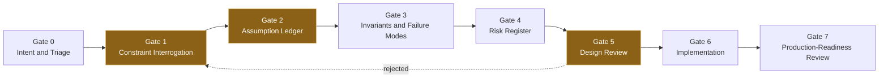
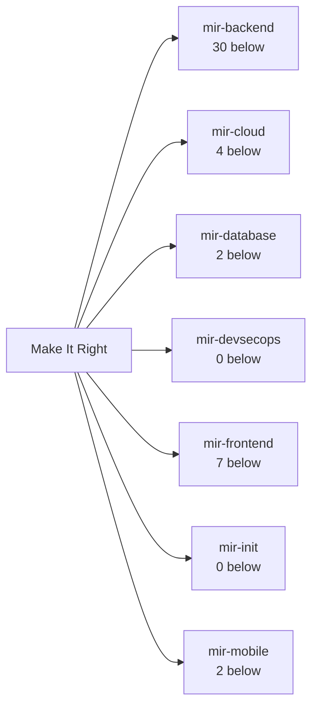
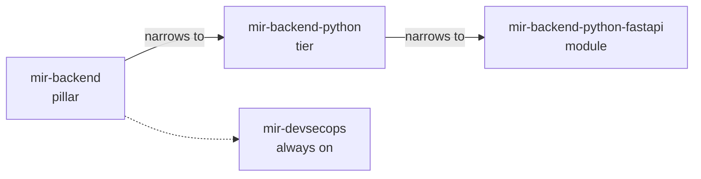
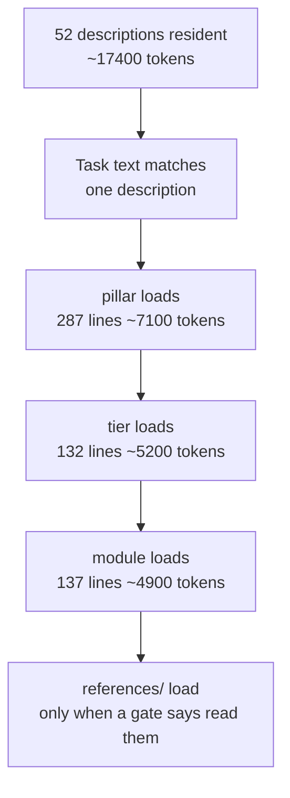
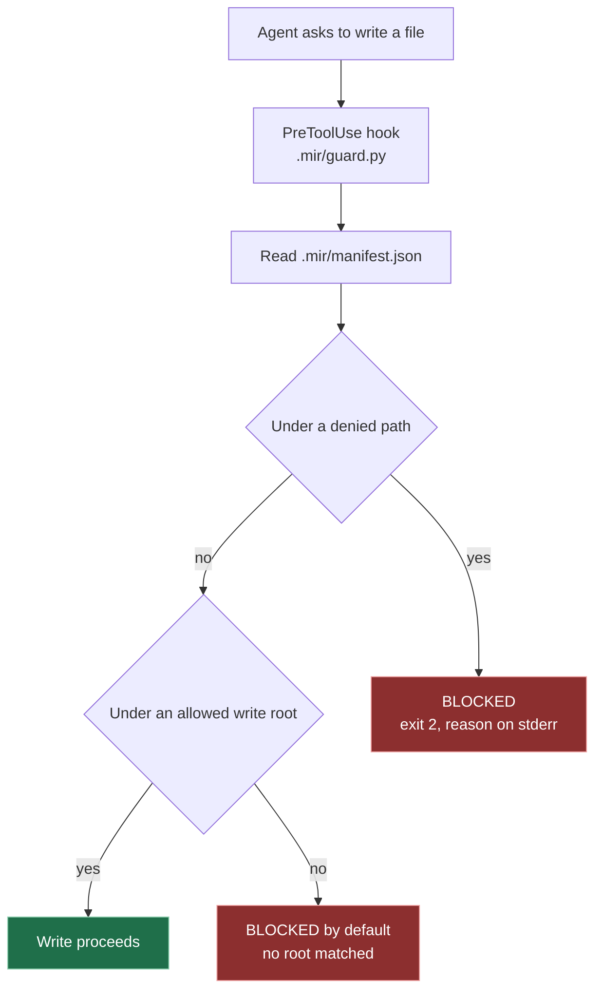

# Make It Right

> **AI makes it work. Make It Right.**
>
> Reliability skills and a per-repository write-policy harness for AI coding agents.

Make It Right helps an agent discover constraints before it writes code. It installs task-specific skills globally, routes each task from broad discipline to stack-specific guidance, and can create a verified write boundary for one repository.

Supports Claude Code, Cursor, Codex CLI, and Antigravity. Start with the [quickstart](#installation), then see the [full skill tree](docs/skill-tree.md).

## At a glance

| If you need to… | Make It Right gives you… |
|---|---|
| Avoid happy-path code that violates unstated constraints | Risk triage, constraint questions, an assumption ledger, invariants, failure modes, and an approved design before implementation |
| Give an agent the right context | Automatic `TRIGGER`/`SKIP` routing through a pillar → tier → module chain |
| Make state-changing work safer | Guidance for retries, concurrency, external calls, migrations, authorization, PII, and delivery controls |
| Limit where an agent can write | A per-repository manifest, guard, hook wiring, and probe from `mir init` |

## The problem → the control

AI coding agents are good at producing locally plausible code. They are less reliable when the important rule is implicit: a retry can double-charge, a race can oversell the last item, a migration can lock a populated table, or a token can identify a user without authorizing that row.

| Failure mode | Control |
|---|---|
| Unstated constraints | Ask the highest-leverage questions before choosing an implementation |
| Hidden invariants and invalid transitions | Record what must always be true and how partial failures are handled |
| Wrong runtime/framework guidance | Load only the matching pillar, runtime/reactivity tier, and framework module |
| Unsafe writes by the agent | Enforce a deny-by-default policy for a repository's protected paths |
| Stale or broken skill references | Validate frontmatter, routing clauses, chains, references, reviewers, and generated diagrams |

The controls are deliberately layered. Skills are instructions the model follows; the optional harness is the filesystem boundary that can block a write.

## How it works

1. `install.sh` links the skill library and reviewer checklists into a host's discovery directories.
2. A task matches skill descriptions. The matching bodies load progressively, from general constraints to framework mechanics.
3. Gated pillars stop for human input at constraint interrogation, assumption confirmation, and design approval.
4. `mir init` is optional. For one repository it records the stack, emits a thin baseline, installs hook wiring, and runs a manifest-derived probe.

<!-- mir:gen:begin id=gates src=docs/gen_diagrams.py -->
### The eight gates

Every pillar runs the same eight gates. No implementation code is written before Gate 6, and the three amber gates stop and wait for a human.



Amber nodes are the three `[USER GATE]` stops -- the model must not proceed past them on its own. They are also named as user gates in the text version.

<details>
<summary>Text version -- The eight gates</summary>

1. Gate 0 -- Intent and Triage
2. Gate 1 -- Constraint Interrogation (stops for the user)
3. Gate 2 -- Assumption Ledger (stops for the user)
4. Gate 3 -- Invariants and Failure Modes
5. Gate 4 -- Risk Register
6. Gate 5 -- Design Review (stops for the user)
7. Gate 6 -- Implementation
8. Gate 7 -- Production-Readiness Review

Step 6 can return to step 2 when rejected.

</details>

<details>
<summary>Links -- The eight gates</summary>

- [EXTENDING.md -- what each gate is for](EXTENDING.md)

</details>
<!-- mir:gen:end id=gates -->

## The pillars

The repository is organized by engineering concern. The full catalog is generated from `init/catalog.py`; the map below is a compact overview.

<!-- mir:gen:begin id=pillar-map src=docs/gen_diagrams.py -->
### Pillar map

7 pillars, 52 skills in total. A pillar is the coarse gate; it loads on a matching task and hands off to a tier and then a module.



<details>
<summary>Text version -- Pillar map</summary>

- Make It Right
  - mir-backend -- 30 tiers and modules below it
  - mir-cloud -- 4 tiers and modules below it
  - mir-database -- 2 tiers and modules below it
  - mir-devsecops -- 0 tiers and modules below it
  - mir-frontend -- 7 tiers and modules below it
  - mir-init -- 0 tiers and modules below it
  - mir-mobile -- 2 tiers and modules below it

</details>

<details>
<summary>Links -- Pillar map</summary>

- [mir-backend](skills/mir-backend/SKILL.md) -- Backend / API
- [mir-cloud](skills/mir-cloud/SKILL.md) -- Cloud / infra
- [mir-database](skills/mir-database/SKILL.md) -- Database
- [mir-devsecops](skills/mir-devsecops/SKILL.md) -- DevSecOps (always on)
- [mir-frontend](skills/mir-frontend/SKILL.md) -- Web frontend
- [mir-init](skills/mir-init/SKILL.md)
- [mir-mobile](skills/mir-mobile/SKILL.md) -- Native mobile

</details>
<!-- mir:gen:end id=pillar-map -->

## Skill selection and the three-tier chain

The skill name encodes the routing chain because hosts scan `skills/` one level deep:

| Name | Role | Example |
|---|---|---|
| `mir-<pillar>` | Broad discipline and gates | `mir-backend` |
| `mir-<pillar>-<runtime>` | Runtime or reactivity mechanics | `mir-backend-python`, `mir-frontend-react` |
| `mir-<pillar>-<runtime>-<framework>` | Framework/library mechanics | `mir-backend-python-fastapi` |

A task that matches FastAPI loads the backend pillar, Python tier, and FastAPI module; the always-on `mir-devsecops` pillar is included in the resolved stack. The complete inventory and labels live in [`docs/skill-tree.md`](docs/skill-tree.md).

<!-- mir:gen:begin id=chain-example src=docs/gen_diagrams.py -->
### Coarse to fine, worked

`catalog.resolve()` turns one answer into this chain, ordered coarse to fine, so the general constraints are in context before the framework mechanics are.



<details>
<summary>Text version -- Coarse to fine, worked</summary>

- mir-backend -- the pillar
  - narrows to: mir-backend-python -- the tier
    - narrows to: mir-backend-python-fastapi -- the module
  - mir-devsecops -- resolved for every stack, never a question

</details>

<details>
<summary>Links -- Coarse to fine, worked</summary>

- [mir-backend](skills/mir-backend/SKILL.md) -- Backend / API
- [mir-backend-python](skills/mir-backend-python/SKILL.md) -- Python (framework not chosen)
- [mir-backend-python-fastapi](skills/mir-backend-python-fastapi/SKILL.md) -- Python + FastAPI
- [mir-devsecops](skills/mir-devsecops/SKILL.md) -- DevSecOps (always on)

</details>
<!-- mir:gen:end id=chain-example -->

## Progressive disclosure and token cost

Descriptions are visible for routing; full skill bodies and references load only when a task earns them. That keeps unrelated framework guidance out of the active context.

<!-- mir:gen:begin id=disclosure src=docs/gen_diagrams.py -->
### Progressive disclosure and what it costs

Nothing below the first box is in context until it is earned. The token figures are measured from the files on disk at generation time, not estimated.



<details>
<summary>Text version -- Progressive disclosure and what it costs</summary>

1. Host idle -- all 52 skill descriptions are resident, about 17400 tokens
2. A task arrives whose wording matches one description's TRIGGER clause
3. mir-backend loads whole -- pillar, 287 body lines, about 7100 tokens
4. mir-backend-python loads whole -- tier, 132 body lines, about 5200 tokens
5. mir-backend-python-fastapi loads whole -- module, 137 body lines, about 4900 tokens
6. reference files load last, and only when a gate tells the model to read one

</details>

<details>
<summary>Links -- Progressive disclosure and what it costs</summary>

- [mir-backend](skills/mir-backend/SKILL.md) -- pillar, 287 body lines
- [mir-backend-python](skills/mir-backend-python/SKILL.md) -- tier, 132 body lines
- [mir-backend-python-fastapi](skills/mir-backend-python-fastapi/SKILL.md) -- module, 137 body lines

</details>
<!-- mir:gen:end id=disclosure -->

## What it supports

### Engineering pillars

| Pillar | Covers |
|---|---|
| [`mir-backend`](skills/mir-backend/SKILL.md) | Stateful backend and API work across runtimes |
| [`mir-cloud`](skills/mir-cloud/SKILL.md) | Provider selection, infrastructure constraints, cost, and exit risk |
| [`mir-database`](skills/mir-database/SKILL.md) | Schema design, consistency, indexes, and safe migrations |
| [`mir-devsecops`](skills/mir-devsecops/SKILL.md) | Untrusted input, dependencies, secrets, and delivery controls; always on |
| [`mir-frontend`](skills/mir-frontend/SKILL.md) | Web UI state, rendering, accessibility, and performance |
| [`mir-mobile`](skills/mir-mobile/SKILL.md) | Native lifecycle, storage, background work, and store rules |
| [`mir-init`](skills/mir-init/SKILL.md) | Per-repository stack detection and write-policy harness generation |

### Host support

`install.sh` can install the global resources. `mir init --target` chooses which host-specific repository harnesses to emit.

| Host | Global resources | Harness wiring from `mir init` | Write-policy status |
|---|---|---|---|
| Claude Code | `~/.claude/skills`, `~/.claude/agents` | `.claude/settings.json` | **Enforced** — guard and registration are verified |
| Codex CLI | `$CODEX_HOME/skills` (default `~/.codex/skills`); reviewers run inline | `.codex/hooks.json` | **Unverified** — file is emitted; host invocation is not proven |
| Antigravity | `~/.gemini/config/skills` (or `GEMINI_HOME`); reviewers run inline | `.agents/hooks.json` | **Unverified** — file is emitted; host invocation is not proven |
| Cursor | Reuses Claude resources only when its third-party config toggle is enabled | None by design | **Advisory / conditional** — no Cursor-specific hook is emitted |

Cursor's toggle is **Include third-party Plugins, Skills, and other configs** under Settings → Rules, Skills, Subagents. It is user-level, not detected by this repository, and off until a human enables it. `install.sh --tool=all` installs Claude, Codex, and Antigravity; use `--tool=cursor` when Cursor is the target.

## Installation

### Quickstart

```bash
git clone https://github.com/anantbhandarkar/make-it-right.git ~/src/make-it-right
cd ~/src/make-it-right
./install.sh --tool=claude
```

Restart or reload the agent so it indexes the new resources. Then describe a task in plain language, or invoke a specific skill such as `/mir-backend <task>`.

`install.sh` creates symlinks, so edits in this checkout are visible to the installed resources after the host reloads. When `python3` and `validate.py` are available it validates first; validation errors stop the install. It does not overwrite a non-symlink destination.

### Installation options

| Command | Use |
|---|---|
| `./install.sh --tool=claude\|cursor\|codex\|antigravity\|all` | Select a host; default is Claude Code |
| `./install.sh --scope=all` | Link every skill; default |
| `./install.sh --scope=pillars` | Link only the seven broad pillars globally |
| `./install.sh --prune --dry-run` | Preview stale links without changing disk |
| `./install.sh --prune-only` | Remove only links this checkout can prove it owns |
| `CLAUDE_HOME=... CODEX_HOME=... GEMINI_HOME=... ./install.sh` | Override target roots |

For a small global index, install the pillars once and let each repository add its resolved tiers/modules:

```bash
./install.sh --tool=claude --scope=pillars
./bin/mir init /path/to/repo --install
```

Normal installation never removes old links. Use `--prune` deliberately when a skill was renamed, deleted, or when narrowing scope. `./bin/mir` is a thin CLI shim; it is not added to `PATH`.

## Project harness (`mir init`)

`install.sh` installs resources. `mir init` prepares one repository and installs no software or application code. It detects the stack, refuses to guess when a pillar is ambiguous or uncovered, and writes the harness all-or-nothing so a half-installed policy cannot look healthy.

### Common commands

```bash
./bin/mir init /path/to/repo --target claude
./bin/mir init . --dry-run
./bin/mir init . --answers answers.json --noninteractive
./bin/mir init . --install
./bin/mir detect /path/to/repo
./bin/mir catalog
```

`--answers` is a JSON object keyed by pillar, for example:

```json
{
  "backend": "mir-backend-python-fastapi",
  "database": "mir-database-postgres"
}
```

`--noninteractive` forbids prompts; it does not authorize a guess. Ambiguity still stops with exit `3` and a paste-ready answers stub. `--target` accepts `claude`, `codex`, `antigravity`, `cursor`, a comma-separated list, or `all`; it defaults to `claude`.

<!-- mir:gen:begin id=init-flow src=docs/gen_diagrams.py -->
### What `mir init` actually does

Detection proposes and never decides, and the run is all-or-nothing: a harness that is half-installed looks installed and enforces nothing.


<details>
<summary>Text version -- What `mir init` actually does</summary>

1. You calls mir init (init/cli.py): mir init .
2. mir init (init/cli.py) calls init/detect.py: detect(repo)
3. init/detect.py replies to mir init (init/cli.py): proposals and conflicts, never a decision
4. mir init (init/cli.py) replies to You: if a pillar is undecided, refuse and list the options
5. You calls mir init (init/cli.py): --answers answers.json
6. mir init (init/cli.py) calls init/catalog.py: resolve(answers)
7. init/catalog.py replies to mir init (init/cli.py): chain-ordered skills plus recorded gaps
8. mir init (init/cli.py) calls init/generate.py: plan(repo, skills, answers)
9. init/generate.py replies to mir init (init/cli.py): one item per destination, each classified first
10. mir init (init/cli.py) calls init/generate.py: apply(repo, items) -- all destinations or none
11. init/generate.py calls your repository: write .mir/, AGENTS.md, CLAUDE.md, merge .claude/settings.json
12. mir init (init/cli.py) calls your repository: run .mir/probe.py against the manifest
13. your repository replies to You: exit 0 only if the guard actually blocked a denied write

</details>

<details>
<summary>Links -- What `mir init` actually does</summary>

- [init/cli.py](init/cli.py) -- the flow above, in order
- [init/detect.py](init/detect.py) -- proposes, never decides
- [init/generate.py](init/generate.py) -- classifies every destination before writing

</details>
<!-- mir:gen:end id=init-flow -->

### Generated project artifacts

| Path | Purpose |
|---|---|
| `AGENTS.md` | Thin always-on baseline: selected pillars, the hard rule, and recorded stack |
| `CLAUDE.md` | Imports `AGENTS.md` and preserves a notes tail |
| `.mir/manifest.json` | Allowed roots, denied paths, selected skills, and declared targets |
| `.mir/guard.py` | Protocol-aware write guard; `.mir/` is protected from the agent |
| `.mir/probe.py` | Replays manifest-derived attacks and checks wiring |
| `.mir/COVERAGE.md` | Per-target capability, probe results, and unproven claims |
| Host hook file | `.claude/settings.json`, `.codex/hooks.json`, or `.agents/hooks.json`; none for Cursor |

The probe runs after generation. Read `.mir/COVERAGE.md` before relying on a harness: a clean probe proves the guard's decisions and the registration file, not that an unverified host actually invokes its hook. Restart Claude Code after generating a fresh hook because its hooks are loaded at session start.

<!-- mir:gen:begin id=trust-boundary src=docs/gen_diagrams.py -->
### The write policy, end to end

Deny by default, and denied paths beat allowed roots. The policy, the guard and the probe all live under `.mir/`, which is itself denied, so an agent cannot widen its own permissions.



Red nodes are refusals and the green node is the only path that writes. Both outcomes are spelled out in words in the text version.

<details>
<summary>Text version -- The write policy, end to end</summary>

- An agent asks to write a file
  - The PreToolUse hook runs .mir/guard.py
    - The guard reads .mir/manifest.json
      - Is the target under a denied path (secrets, .git, .mir, the hook registration, home config)
        - yes: BLOCKED -- denied paths win over allowed roots
        - no: Is the target under an allowed write root
          - yes: ALLOWED -- the write proceeds
          - no: BLOCKED -- deny by default, nothing outside an allowed root is writable

</details>

<details>
<summary>Links -- The write policy, end to end</summary>

- [init/schema.py](init/schema.py) -- the baseline denied set, with the reason for each
- [init/guard.py](init/guard.py) -- the hook that decides
- [init/probe.py](init/probe.py) -- proves the guard really blocks

</details>
<!-- mir:gen:end id=trust-boundary -->

## Validate and extend

```bash
./validate.py
./validate.py --json
python3 docs/gen_diagrams.py --check
python3 init/test_init.py
```

`validate.py` exits `0` when there are no errors, `1` for validation errors, and `2` when the skill tree cannot be read. Warnings are reported separately. Generated Mermaid blocks are owned by `docs/gen_diagrams.py`; do not edit between `mir:gen` markers. Use `--write` to regenerate them after changing the skill tree.

To add or reorganize skills, start with [`EXTENDING.md`](EXTENDING.md). The project harness and acceptance criteria are described in [`GOAL.md`](GOAL.md).

## Honest limits

- Skills are guidance. A model can ignore instructions; only the selected host's hook can enforce the repository write policy.
- Codex CLI and Antigravity hook invocation is not proven by this repository. Cursor enforcement is conditional on its third-party configuration toggle.
- The guard is a path policy, not a complete application security boundary. Read `.mir/COVERAGE.md` for exactly what the probe did and did not test.
- `install.sh` is a Bash/symlink installer. There is no Windows or package-manager installation path in this repository.

## Further reading

| Topic | Link |
|---|---|
| Complete skill inventory | [`docs/skill-tree.md`](docs/skill-tree.md) |
| How to extend the tree | [`EXTENDING.md`](EXTENDING.md) |
| Goals and acceptance criteria | [`GOAL.md`](GOAL.md) |
| Release process | [`RELEASING.md`](RELEASING.md) |
| License and notice | [`LICENSE`](LICENSE) · [`NOTICE`](NOTICE) |

## License

MIT — see [`LICENSE`](LICENSE).
