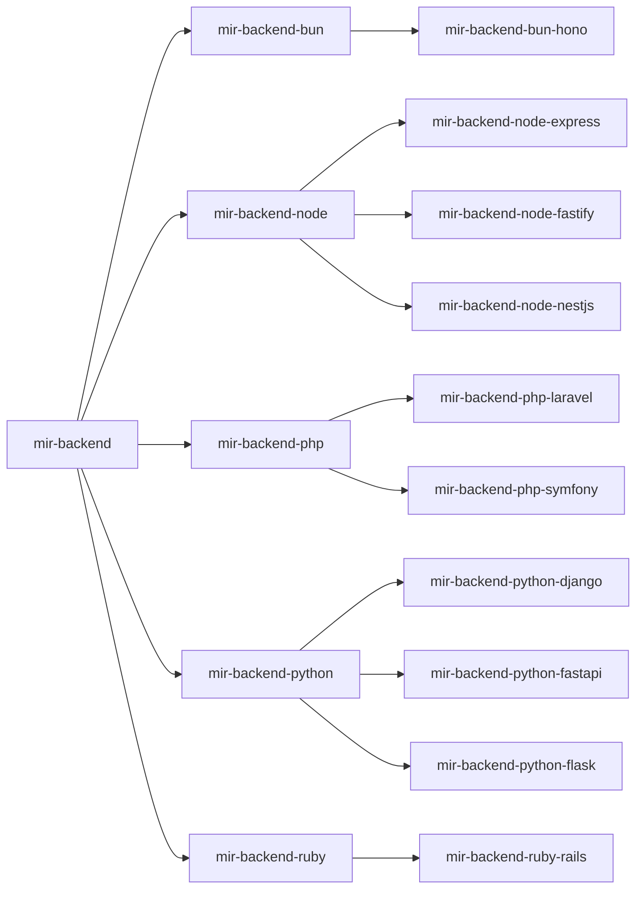
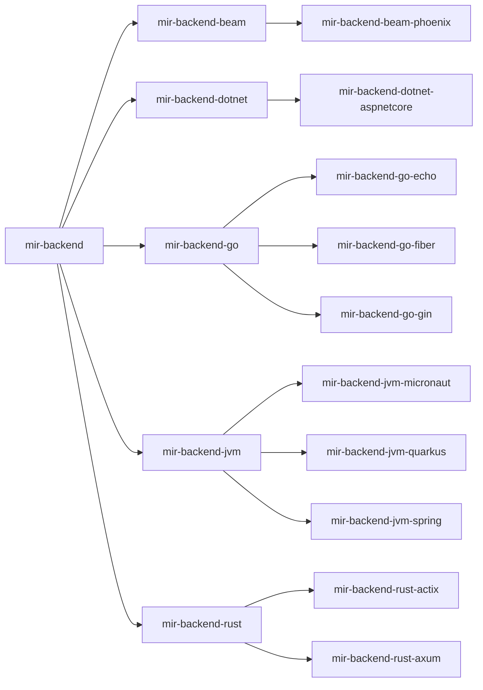
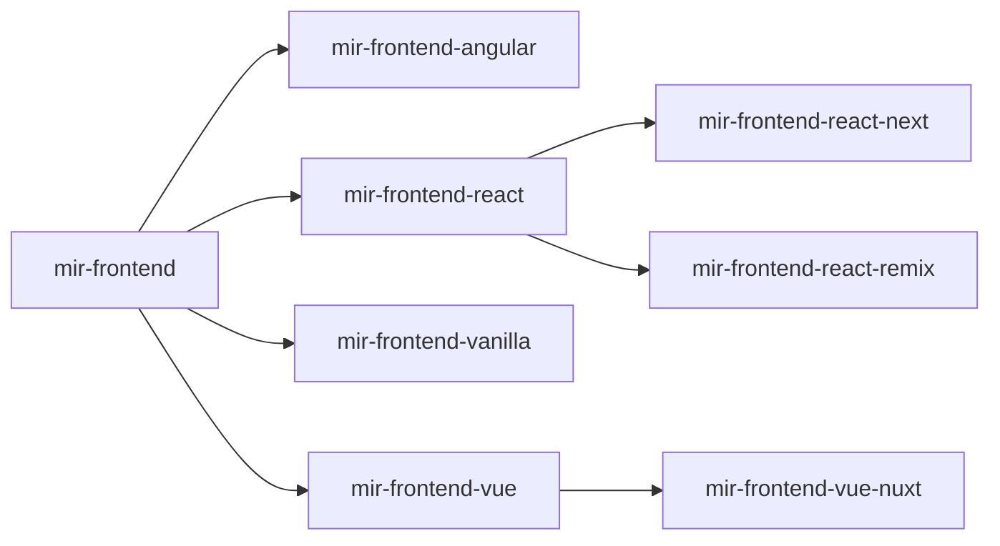
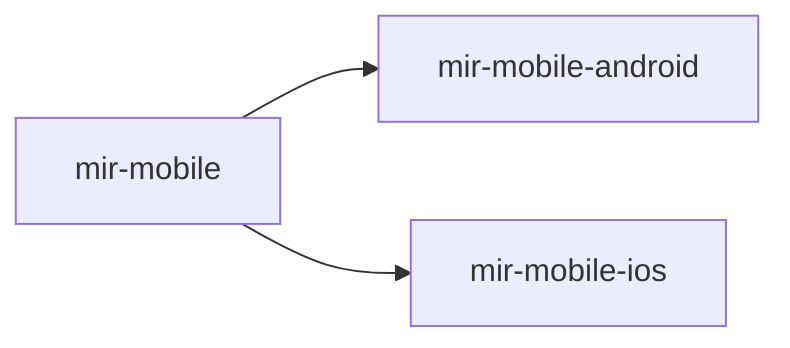
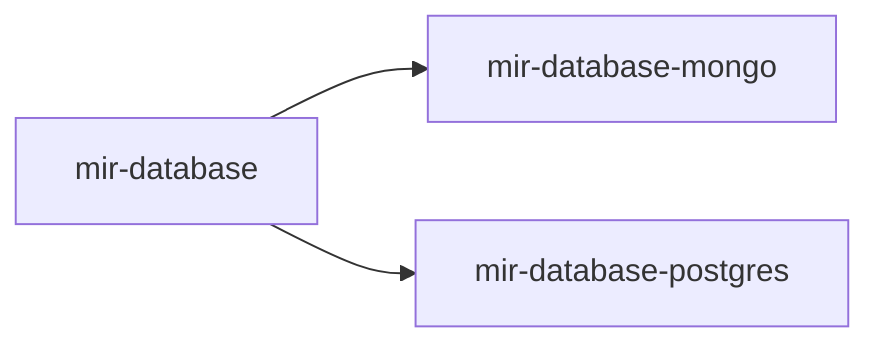
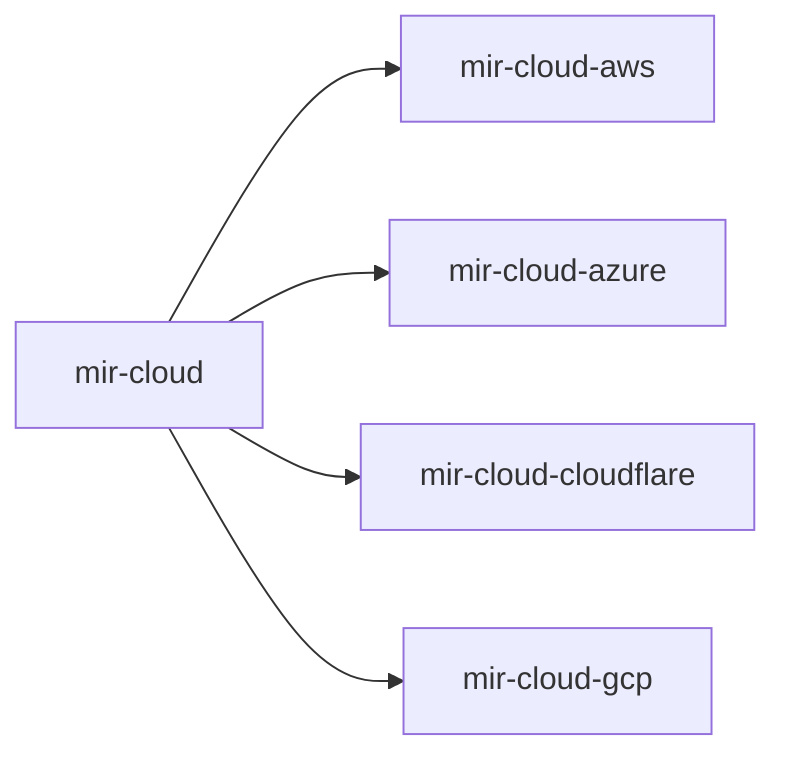
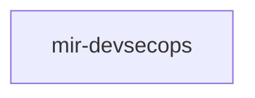
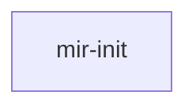
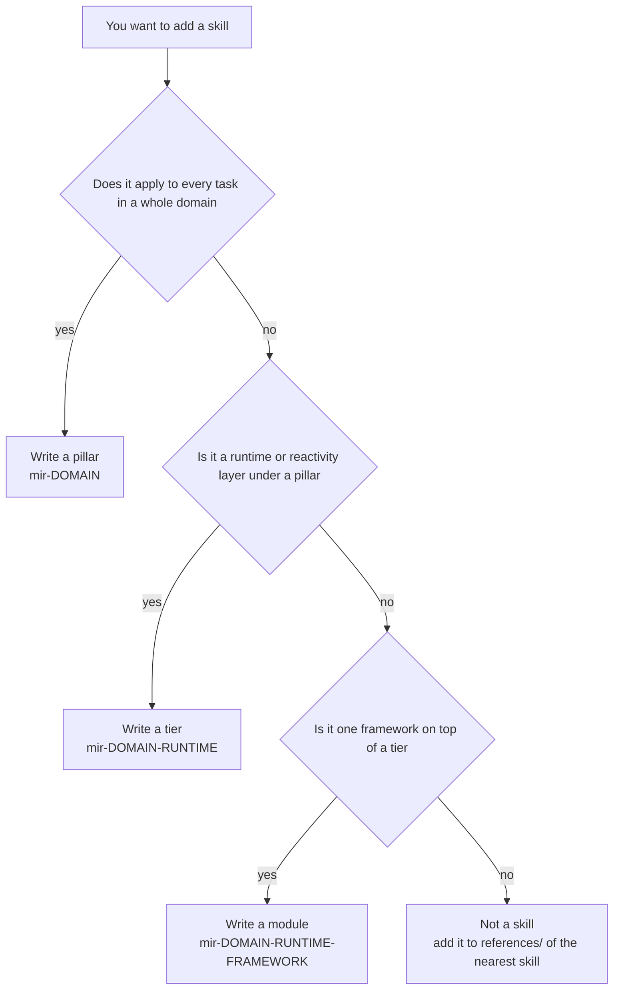

# The skill tree

The full Make It Right inventory, how a task is routed through it, and where a new skill
goes. `README.md` keeps the pitch and the install; this file keeps the map.

Every diagram and every list below sits inside a `mir:gen` block and is produced by
[`gen_diagrams.py`](gen_diagrams.py) from `init/catalog.py` — the same module `mir init`
resolves against. Nothing here is typed by hand, `validate.py` re-derives all of it on
every run (`DIA001`), and `install.sh` refuses to install on a `validate.py` error. So a
number on this page cannot quietly stop being true; three documents in this repo already
disagreed about the skill count once, which is the whole reason for the machinery.

To update after changing the tree:

```bash
python3 docs/gen_diagrams.py --check    # what drifted, as a diff; writes nothing
python3 docs/gen_diagrams.py --write    # regenerate every block, in place
```

Each diagram carries a **Text version** below it. That is not a fallback — Mermaid conveys
no node relationships to assistive technology, and this file is also read in `less`, on
mirrors that do not render Mermaid, and inside agent context windows. Node links *inside* a
Mermaid block do not work on GitHub (`securityLevel: strict` plus the iframe CSP), so each
diagram carries a separate **Links** list instead.

---

## What lives in the README instead

Six of these blocks are hosted by `README.md`, because they are what a reader needs before
they have decided to install anything: the pillar map, the worked coarse-to-fine chain, the
progressive-disclosure model, the eight gates, the `mir init` sequence, and the write-policy
trust boundary. The same id in two documents is a `DIA002` error, deliberately — two copies
of a generated block cannot be kept in sync by anything — so they were **moved**, not
copied.

- [The eight gates](../README.md#the-eight-gates)
- [Pillar map](../README.md#the-pillars)
- [Coarse to fine, worked](../README.md#skill-selection-and-the-three-tier-chain)
- [Progressive disclosure and what it costs](../README.md#progressive-disclosure-and-token-cost)
- [What `mir init` does, and the write policy it installs](../README.md#project-harness-mir-init)

What stays here is the inventory — one shard per pillar, too dense for a front page — and
the placement decision for a new skill.

---

## The inventory

One shard per pillar, and the backend pillar split by runtime because 30 tiers and modules
on one canvas is not a diagram. Sharding is enforced by the generator, not by whoever edits
this file: past 16 nodes it warns (`DIA003`), past 24 it refuses to emit at all.

Between them the shards list **every** skill in the tree, written and planned, with its
`overlay.json` label — this is the inventory, not a picture of it.

<!-- mir:gen:begin id=tree-backend-dynamic src=docs/gen_diagrams.py -->
### The backend pillar -- dynamic runtimes

16 written, 0 listed in `.mir-planned`. Derived from `skills/` on disk, so a new skill appears here the moment its directory does.



<details>
<summary>Text version -- The backend pillar -- dynamic runtimes</summary>

- mir-backend
  - mir-backend-bun
    - mir-backend-bun-hono
  - mir-backend-node
    - mir-backend-node-express
    - mir-backend-node-fastify
    - mir-backend-node-nestjs
  - mir-backend-php
    - mir-backend-php-laravel
    - mir-backend-php-symfony
  - mir-backend-python
    - mir-backend-python-django
    - mir-backend-python-fastapi
    - mir-backend-python-flask
  - mir-backend-ruby
    - mir-backend-ruby-rails

</details>

<details>
<summary>Links -- The backend pillar -- dynamic runtimes</summary>

- [mir-backend](../skills/mir-backend/SKILL.md) -- Backend / API
- [mir-backend-bun](../skills/mir-backend-bun/SKILL.md) -- Bun (framework not chosen)
- [mir-backend-bun-hono](../skills/mir-backend-bun-hono/SKILL.md) -- Bun + Hono
- [mir-backend-node](../skills/mir-backend-node/SKILL.md) -- Node (framework not chosen)
- [mir-backend-node-express](../skills/mir-backend-node-express/SKILL.md) -- Node + Express
- [mir-backend-node-fastify](../skills/mir-backend-node-fastify/SKILL.md) -- Node + Fastify
- [mir-backend-node-nestjs](../skills/mir-backend-node-nestjs/SKILL.md) -- Node + NestJS
- [mir-backend-php](../skills/mir-backend-php/SKILL.md) -- PHP (framework not chosen)
- [mir-backend-php-laravel](../skills/mir-backend-php-laravel/SKILL.md) -- PHP + Laravel
- [mir-backend-php-symfony](../skills/mir-backend-php-symfony/SKILL.md) -- PHP + Symfony
- [mir-backend-python](../skills/mir-backend-python/SKILL.md) -- Python (framework not chosen)
- [mir-backend-python-django](../skills/mir-backend-python-django/SKILL.md) -- Python + Django
- [mir-backend-python-fastapi](../skills/mir-backend-python-fastapi/SKILL.md) -- Python + FastAPI
- [mir-backend-python-flask](../skills/mir-backend-python-flask/SKILL.md) -- Python + Flask
- [mir-backend-ruby](../skills/mir-backend-ruby/SKILL.md) -- Ruby (framework not chosen)
- [mir-backend-ruby-rails](../skills/mir-backend-ruby-rails/SKILL.md) -- Ruby on Rails

</details>
<!-- mir:gen:end id=tree-backend-dynamic -->

<!-- mir:gen:begin id=tree-backend-compiled src=docs/gen_diagrams.py -->
### The backend pillar -- compiled and VM runtimes

16 written, 0 listed in `.mir-planned`. Derived from `skills/` on disk, so a new skill appears here the moment its directory does.



<details>
<summary>Text version -- The backend pillar -- compiled and VM runtimes</summary>

- mir-backend
  - mir-backend-beam
    - mir-backend-beam-phoenix
  - mir-backend-dotnet
    - mir-backend-dotnet-aspnetcore
  - mir-backend-go
    - mir-backend-go-echo
    - mir-backend-go-fiber
    - mir-backend-go-gin
  - mir-backend-jvm
    - mir-backend-jvm-micronaut
    - mir-backend-jvm-quarkus
    - mir-backend-jvm-spring
  - mir-backend-rust
    - mir-backend-rust-actix
    - mir-backend-rust-axum

</details>

<details>
<summary>Links -- The backend pillar -- compiled and VM runtimes</summary>

- [mir-backend](../skills/mir-backend/SKILL.md) -- Backend / API
- [mir-backend-beam](../skills/mir-backend-beam/SKILL.md) -- Elixir / Erlang (framework not chosen)
- [mir-backend-beam-phoenix](../skills/mir-backend-beam-phoenix/SKILL.md) -- Elixir + Phoenix
- [mir-backend-dotnet](../skills/mir-backend-dotnet/SKILL.md) -- .NET (framework not chosen)
- [mir-backend-dotnet-aspnetcore](../skills/mir-backend-dotnet-aspnetcore/SKILL.md) -- ASP.NET Core
- [mir-backend-go](../skills/mir-backend-go/SKILL.md) -- Go (framework not chosen)
- [mir-backend-go-echo](../skills/mir-backend-go-echo/SKILL.md) -- Go + Echo
- [mir-backend-go-fiber](../skills/mir-backend-go-fiber/SKILL.md) -- Go + Fiber
- [mir-backend-go-gin](../skills/mir-backend-go-gin/SKILL.md) -- Go + Gin
- [mir-backend-jvm](../skills/mir-backend-jvm/SKILL.md) -- JVM / Java / Kotlin (framework not chosen)
- [mir-backend-jvm-micronaut](../skills/mir-backend-jvm-micronaut/SKILL.md) -- JVM + Micronaut
- [mir-backend-jvm-quarkus](../skills/mir-backend-jvm-quarkus/SKILL.md) -- JVM + Quarkus
- [mir-backend-jvm-spring](../skills/mir-backend-jvm-spring/SKILL.md) -- JVM + Spring Boot
- [mir-backend-rust](../skills/mir-backend-rust/SKILL.md) -- Rust (framework not chosen)
- [mir-backend-rust-actix](../skills/mir-backend-rust-actix/SKILL.md) -- Rust + Actix
- [mir-backend-rust-axum](../skills/mir-backend-rust-axum/SKILL.md) -- Rust + Axum

</details>
<!-- mir:gen:end id=tree-backend-compiled -->

<!-- mir:gen:begin id=tree-frontend src=docs/gen_diagrams.py -->
### The frontend pillar

8 written, 0 listed in `.mir-planned`. Derived from `skills/` on disk, so a new skill appears here the moment its directory does.



<details>
<summary>Text version -- The frontend pillar</summary>

- mir-frontend
  - mir-frontend-angular
  - mir-frontend-react
    - mir-frontend-react-next
    - mir-frontend-react-remix
  - mir-frontend-vanilla
  - mir-frontend-vue
    - mir-frontend-vue-nuxt

</details>

<details>
<summary>Links -- The frontend pillar</summary>

- [mir-frontend](../skills/mir-frontend/SKILL.md) -- Web frontend
- [mir-frontend-angular](../skills/mir-frontend-angular/SKILL.md)
- [mir-frontend-react](../skills/mir-frontend-react/SKILL.md) -- React (Vite / SPA, no meta-framework)
- [mir-frontend-react-next](../skills/mir-frontend-react-next/SKILL.md) -- React + Next.js
- [mir-frontend-react-remix](../skills/mir-frontend-react-remix/SKILL.md)
- [mir-frontend-vanilla](../skills/mir-frontend-vanilla/SKILL.md) -- No framework (vanilla JS / Web Components)
- [mir-frontend-vue](../skills/mir-frontend-vue/SKILL.md) -- Vue 3
- [mir-frontend-vue-nuxt](../skills/mir-frontend-vue-nuxt/SKILL.md) -- Vue + Nuxt

</details>
<!-- mir:gen:end id=tree-frontend -->

<!-- mir:gen:begin id=tree-mobile src=docs/gen_diagrams.py -->
### The mobile pillar

3 written, 0 listed in `.mir-planned`. Derived from `skills/` on disk, so a new skill appears here the moment its directory does.



<details>
<summary>Text version -- The mobile pillar</summary>

- mir-mobile
  - mir-mobile-android
  - mir-mobile-ios

</details>

<details>
<summary>Links -- The mobile pillar</summary>

- [mir-mobile](../skills/mir-mobile/SKILL.md) -- Native mobile
- [mir-mobile-android](../skills/mir-mobile-android/SKILL.md) -- Android (Kotlin / Compose)
- [mir-mobile-ios](../skills/mir-mobile-ios/SKILL.md) -- iOS (Swift / SwiftUI)

</details>
<!-- mir:gen:end id=tree-mobile -->

<!-- mir:gen:begin id=tree-database src=docs/gen_diagrams.py -->
### The database pillar

3 written, 0 listed in `.mir-planned`. Derived from `skills/` on disk, so a new skill appears here the moment its directory does.



<details>
<summary>Text version -- The database pillar</summary>

- mir-database
  - mir-database-mongo
  - mir-database-postgres

</details>

<details>
<summary>Links -- The database pillar</summary>

- [mir-database](../skills/mir-database/SKILL.md) -- Database
- [mir-database-mongo](../skills/mir-database-mongo/SKILL.md) -- MongoDB
- [mir-database-postgres](../skills/mir-database-postgres/SKILL.md) -- PostgreSQL

</details>
<!-- mir:gen:end id=tree-database -->

<!-- mir:gen:begin id=tree-cloud src=docs/gen_diagrams.py -->
### The cloud pillar

5 written, 0 listed in `.mir-planned`. Derived from `skills/` on disk, so a new skill appears here the moment its directory does.



<details>
<summary>Text version -- The cloud pillar</summary>

- mir-cloud
  - mir-cloud-aws
  - mir-cloud-azure
  - mir-cloud-cloudflare
  - mir-cloud-gcp

</details>

<details>
<summary>Links -- The cloud pillar</summary>

- [mir-cloud](../skills/mir-cloud/SKILL.md) -- Cloud / infra
- [mir-cloud-aws](../skills/mir-cloud-aws/SKILL.md)
- [mir-cloud-azure](../skills/mir-cloud-azure/SKILL.md)
- [mir-cloud-cloudflare](../skills/mir-cloud-cloudflare/SKILL.md)
- [mir-cloud-gcp](../skills/mir-cloud-gcp/SKILL.md)

</details>
<!-- mir:gen:end id=tree-cloud -->

<!-- mir:gen:begin id=tree-devsecops src=docs/gen_diagrams.py -->
### The devsecops pillar

1 written, 0 listed in `.mir-planned`. Derived from `skills/` on disk, so a new skill appears here the moment its directory does.



<details>
<summary>Text version -- The devsecops pillar</summary>

1. mir-devsecops

</details>

<details>
<summary>Links -- The devsecops pillar</summary>

- [mir-devsecops](../skills/mir-devsecops/SKILL.md) -- DevSecOps (always on)

</details>
<!-- mir:gen:end id=tree-devsecops -->

<!-- mir:gen:begin id=tree-init src=docs/gen_diagrams.py -->
### The init pillar

1 written, 0 listed in `.mir-planned`. Derived from `skills/` on disk, so a new skill appears here the moment its directory does.



<details>
<summary>Text version -- The init pillar</summary>

1. mir-init

</details>

<details>
<summary>Links -- The init pillar</summary>

- [mir-init](../skills/mir-init/SKILL.md)

</details>
<!-- mir:gen:end id=tree-init -->

---

## Selecting a subtree, and what it installs

`mir init` picks the part of the tree a repo actually needs, then installs the write policy
that the skills assume is in force. Both diagrams for that — the run sequence and the
write-policy decision flow — live in
[`README.md`](../README.md#project-harness-mir-init), which is where a reader meets the
harness first.

---

## Adding to the tree

<!-- mir:gen:begin id=placement src=docs/gen_diagrams.py -->
### Where a new skill goes

The name is the chain: `validate.py` reads pillar, tier and module straight out of the hyphens, so putting a skill at the wrong depth breaks it loudly.



<details>
<summary>Text version -- Where a new skill goes</summary>

- You want to add a skill
  - Does it apply to every task in a whole domain
    - yes: Write a pillar -- mir-DOMAIN
    - no: Is it a runtime or reactivity layer under an existing pillar
      - yes: Write a tier -- mir-DOMAIN-RUNTIME
      - no: Is it one framework on top of an existing tier
        - yes: Write a module -- mir-DOMAIN-RUNTIME-FRAMEWORK
        - no: Not a skill -- add it to references/ of the nearest existing skill

</details>

<details>
<summary>Links -- Where a new skill goes</summary>

- [EXTENDING.md](../EXTENDING.md) -- the naming convention and the size budgets
- [validate.py](../validate.py) -- enforces the chain the name implies

</details>
<!-- mir:gen:end id=placement -->

Read [`EXTENDING.md`](../EXTENDING.md) before writing one: the description is the router,
and a skill whose description has no `TRIGGER` and `SKIP` clause never gets loaded (or
gets loaded over everything).

---

## A note for whoever moves a block between documents

Move it, do not copy it: the same id in two documents is a `DIA002` error, deliberately,
because two copies of a generated block cannot be kept in sync by anything. A block that
lives in no document at all is a `DIA004` warning for the mirrored reason — it will never
be seen.

Link paths are rendered relative to the document that carries the block, so after moving a
block run `python3 docs/gen_diagrams.py --write` — a straight copy-paste leaves `../skills/…`
paths that are wrong from the repo root, and `DIA001` will say so.
