# The skill tree

The full Make It Right inventory, how a task is routed through it, and where a new skill
goes. `README.md` keeps the pitch and the install; this file keeps the map.

Every diagram and every list below sits inside a `mir:gen` block and is produced by
[`gen_diagrams.py`](gen_diagrams.py) from `init/catalog.py` — the same module `mir init`
resolves against. Nothing here is typed by hand, `validate.py` re-derives all of it on
every run (`DIA001`), and `install.sh` refuses to install on a `validate.py` error. So a
number on this page cannot quietly stop being true; three documents in this repo already
disagreed about the skill count once, which is the whole reason for the machinery.

To update after changing the tree:

```bash
python3 docs/gen_diagrams.py --check    # what drifted, as a diff; writes nothing
python3 docs/gen_diagrams.py --write    # regenerate every block, in place
```

Each diagram carries a **Text version** below it. That is not a fallback — Mermaid conveys
no node relationships to assistive technology, and this file is also read in `less`, on
mirrors that do not render Mermaid, and inside agent context windows. Node links *inside* a
Mermaid block do not work on GitHub (`securityLevel: strict` plus the iframe CSP), so each
diagram carries a separate **Links** list instead.

---

## The map

<!-- mir:gen:begin id=pillar-map src=docs/gen_diagrams.py -->
### Pillar map

7 pillars, 48 skills in total. A pillar is the coarse gate; it loads on a matching task and hands off to a tier and then a module.

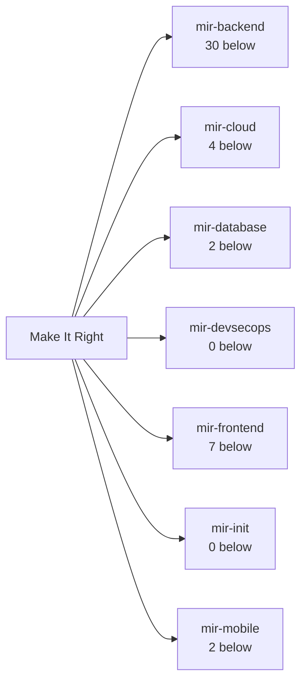

<details>
<summary>Text version -- Pillar map</summary>

- Make It Right
  - mir-backend -- 30 tiers and modules below it
  - mir-cloud -- 4 tiers and modules below it
  - mir-database -- 2 tiers and modules below it
  - mir-devsecops -- 0 tiers and modules below it
  - mir-frontend -- 7 tiers and modules below it
  - mir-init -- 0 tiers and modules below it
  - mir-mobile -- 2 tiers and modules below it

</details>

<details>
<summary>Links -- Pillar map</summary>

- [mir-backend](../skills/mir-backend/SKILL.md) -- Backend / API
- [mir-cloud](../skills/mir-cloud/SKILL.md) -- Cloud / infra
- [mir-database](../skills/mir-database/SKILL.md) -- Database
- [mir-devsecops](../skills/mir-devsecops/SKILL.md) -- DevSecOps (always on)
- [mir-frontend](../skills/mir-frontend/SKILL.md) -- Web frontend
- [mir-init](../skills/mir-init/SKILL.md)
- [mir-mobile](../skills/mir-mobile/SKILL.md) -- Native mobile

</details>
<!-- mir:gen:end id=pillar-map -->

---

## How a task reaches one skill

A pillar is the coarse gate. It loads on a matching task, runs the gates, and hands off to
a runtime tier and then to a framework module. The chain is resolved by
`catalog.resolve()`, and it is ordered coarse-to-fine so the general constraints are in
context before the framework mechanics that depend on them.

<!-- mir:gen:begin id=chain-example src=docs/gen_diagrams.py -->
### Coarse to fine, worked

`catalog.resolve()` turns one answer into this chain, ordered coarse to fine, so the general constraints are in context before the framework mechanics are.

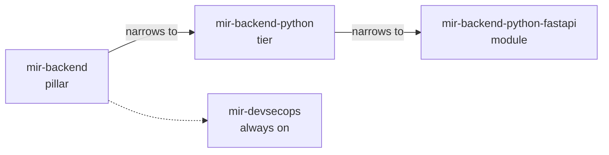

<details>
<summary>Text version -- Coarse to fine, worked</summary>

- mir-backend -- the pillar
  - narrows to: mir-backend-python -- the tier
    - narrows to: mir-backend-python-fastapi -- the module
  - mir-devsecops -- resolved for every stack, never a question

</details>

<details>
<summary>Links -- Coarse to fine, worked</summary>

- [mir-backend](../skills/mir-backend/SKILL.md) -- Backend / API
- [mir-backend-python](../skills/mir-backend-python/SKILL.md) -- Python (framework not chosen)
- [mir-backend-python-fastapi](../skills/mir-backend-python-fastapi/SKILL.md) -- Python + FastAPI
- [mir-devsecops](../skills/mir-devsecops/SKILL.md) -- DevSecOps (always on)

</details>
<!-- mir:gen:end id=chain-example -->

<!-- mir:gen:begin id=disclosure src=docs/gen_diagrams.py -->
### Progressive disclosure and what it costs

Nothing below the first box is in context until it is earned. The token figures are measured from the files on disk at generation time, not estimated.

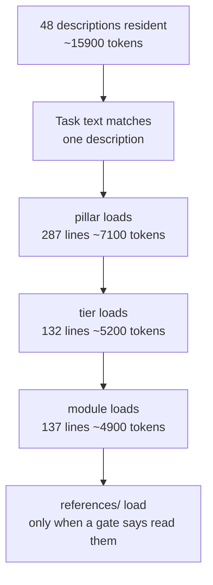

<details>
<summary>Text version -- Progressive disclosure and what it costs</summary>

1. Host idle -- all 48 skill descriptions are resident, about 15900 tokens
2. A task arrives whose wording matches one description's TRIGGER clause
3. mir-backend loads whole -- pillar, 287 body lines, about 7100 tokens
4. mir-backend-python loads whole -- tier, 132 body lines, about 5200 tokens
5. mir-backend-python-fastapi loads whole -- module, 137 body lines, about 4900 tokens
6. reference files load last, and only when a gate tells the model to read one

</details>

<details>
<summary>Links -- Progressive disclosure and what it costs</summary>

- [mir-backend](../skills/mir-backend/SKILL.md) -- pillar, 287 body lines
- [mir-backend-python](../skills/mir-backend-python/SKILL.md) -- tier, 132 body lines
- [mir-backend-python-fastapi](../skills/mir-backend-python-fastapi/SKILL.md) -- module, 137 body lines

</details>
<!-- mir:gen:end id=disclosure -->

Only the descriptions are always resident. Everything else is earned: a body loads whole
once its description matches, which is why `validate.py` caps a body at 380 lines
(`CTX001`) and why reference files are read only when a gate names one.

<!-- mir:gen:begin id=gates src=docs/gen_diagrams.py -->
### The eight gates

Every pillar runs the same eight gates. No implementation code is written before Gate 6, and the three amber gates stop and wait for a human.

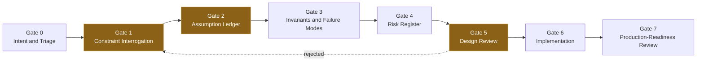

Amber nodes are the three `[USER GATE]` stops -- the model must not proceed past them on its own. They are also named as user gates in the text version.

<details>
<summary>Text version -- The eight gates</summary>

1. Gate 0 -- Intent and Triage
2. Gate 1 -- Constraint Interrogation (stops for the user)
3. Gate 2 -- Assumption Ledger (stops for the user)
4. Gate 3 -- Invariants and Failure Modes
5. Gate 4 -- Risk Register
6. Gate 5 -- Design Review (stops for the user)
7. Gate 6 -- Implementation
8. Gate 7 -- Production-Readiness Review

Step 6 can return to step 2 when rejected.

</details>

<details>
<summary>Links -- The eight gates</summary>

- [EXTENDING.md -- what each gate is for](../EXTENDING.md)

</details>
<!-- mir:gen:end id=gates -->

---

## The inventory

One shard per pillar, and the backend pillar split by runtime because 30 tiers and modules
on one canvas is not a diagram. Sharding is enforced by the generator, not by whoever edits
this file: past 16 nodes it warns (`DIA003`), past 24 it refuses to emit at all.

Between them the shards list **every** skill in the tree, written and planned, with its
`overlay.json` label — this is the inventory, not a picture of it.

<!-- mir:gen:begin id=tree-backend-dynamic src=docs/gen_diagrams.py -->
### The backend pillar -- dynamic runtimes

16 written, 0 listed in `.mir-planned`. Derived from `skills/` on disk, so a new skill appears here the moment its directory does.

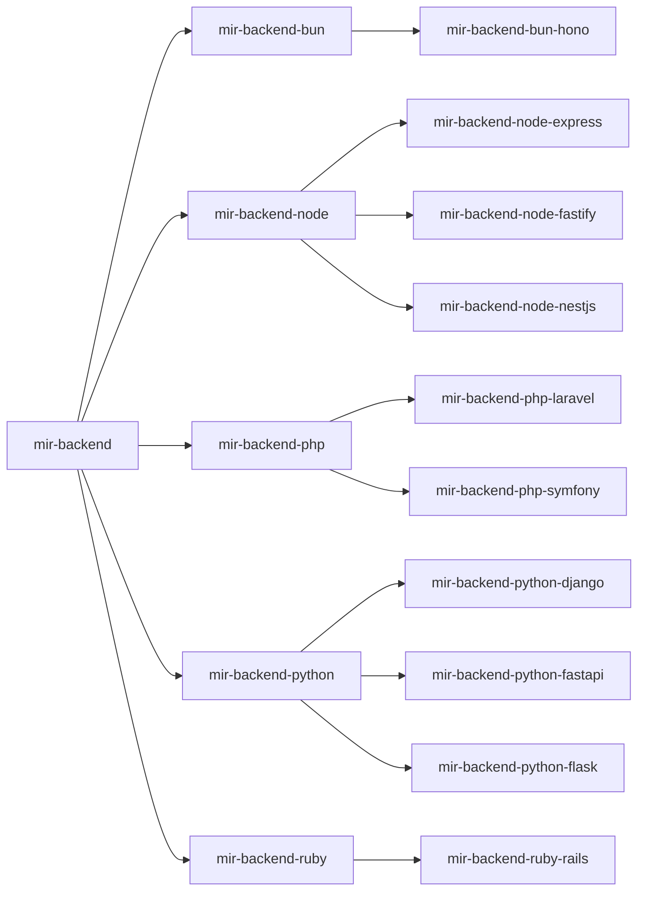

<details>
<summary>Text version -- The backend pillar -- dynamic runtimes</summary>

- mir-backend
  - mir-backend-bun
    - mir-backend-bun-hono
  - mir-backend-node
    - mir-backend-node-express
    - mir-backend-node-fastify
    - mir-backend-node-nestjs
  - mir-backend-php
    - mir-backend-php-laravel
    - mir-backend-php-symfony
  - mir-backend-python
    - mir-backend-python-django
    - mir-backend-python-fastapi
    - mir-backend-python-flask
  - mir-backend-ruby
    - mir-backend-ruby-rails

</details>

<details>
<summary>Links -- The backend pillar -- dynamic runtimes</summary>

- [mir-backend](../skills/mir-backend/SKILL.md) -- Backend / API
- [mir-backend-bun](../skills/mir-backend-bun/SKILL.md) -- Bun (framework not chosen)
- [mir-backend-bun-hono](../skills/mir-backend-bun-hono/SKILL.md) -- Bun + Hono
- [mir-backend-node](../skills/mir-backend-node/SKILL.md) -- Node (framework not chosen)
- [mir-backend-node-express](../skills/mir-backend-node-express/SKILL.md) -- Node + Express
- [mir-backend-node-fastify](../skills/mir-backend-node-fastify/SKILL.md) -- Node + Fastify
- [mir-backend-node-nestjs](../skills/mir-backend-node-nestjs/SKILL.md) -- Node + NestJS
- [mir-backend-php](../skills/mir-backend-php/SKILL.md) -- PHP (framework not chosen)
- [mir-backend-php-laravel](../skills/mir-backend-php-laravel/SKILL.md) -- PHP + Laravel
- [mir-backend-php-symfony](../skills/mir-backend-php-symfony/SKILL.md) -- PHP + Symfony
- [mir-backend-python](../skills/mir-backend-python/SKILL.md) -- Python (framework not chosen)
- [mir-backend-python-django](../skills/mir-backend-python-django/SKILL.md) -- Python + Django
- [mir-backend-python-fastapi](../skills/mir-backend-python-fastapi/SKILL.md) -- Python + FastAPI
- [mir-backend-python-flask](../skills/mir-backend-python-flask/SKILL.md) -- Python + Flask
- [mir-backend-ruby](../skills/mir-backend-ruby/SKILL.md) -- Ruby (framework not chosen)
- [mir-backend-ruby-rails](../skills/mir-backend-ruby-rails/SKILL.md) -- Ruby on Rails

</details>
<!-- mir:gen:end id=tree-backend-dynamic -->

<!-- mir:gen:begin id=tree-backend-compiled src=docs/gen_diagrams.py -->
### The backend pillar -- compiled and VM runtimes

16 written, 0 listed in `.mir-planned`. Derived from `skills/` on disk, so a new skill appears here the moment its directory does.

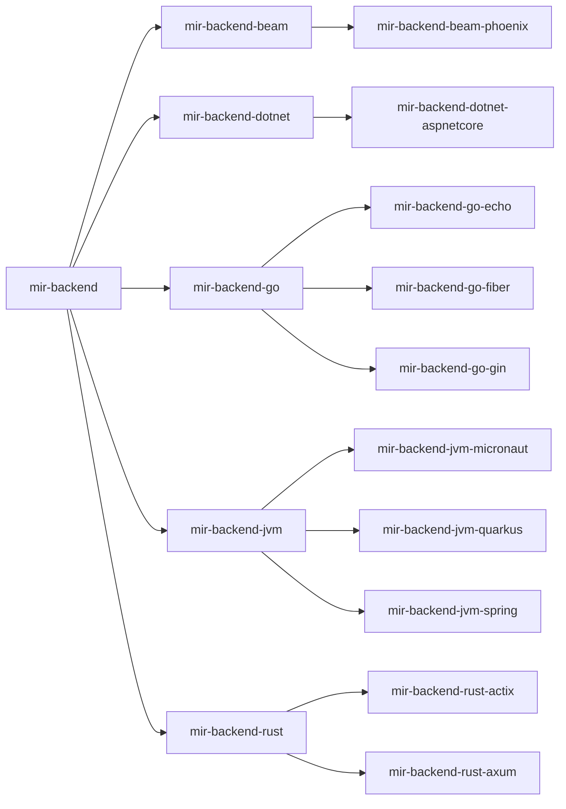

<details>
<summary>Text version -- The backend pillar -- compiled and VM runtimes</summary>

- mir-backend
  - mir-backend-beam
    - mir-backend-beam-phoenix
  - mir-backend-dotnet
    - mir-backend-dotnet-aspnetcore
  - mir-backend-go
    - mir-backend-go-echo
    - mir-backend-go-fiber
    - mir-backend-go-gin
  - mir-backend-jvm
    - mir-backend-jvm-micronaut
    - mir-backend-jvm-quarkus
    - mir-backend-jvm-spring
  - mir-backend-rust
    - mir-backend-rust-actix
    - mir-backend-rust-axum

</details>

<details>
<summary>Links -- The backend pillar -- compiled and VM runtimes</summary>

- [mir-backend](../skills/mir-backend/SKILL.md) -- Backend / API
- [mir-backend-beam](../skills/mir-backend-beam/SKILL.md) -- Elixir / Erlang (framework not chosen)
- [mir-backend-beam-phoenix](../skills/mir-backend-beam-phoenix/SKILL.md) -- Elixir + Phoenix
- [mir-backend-dotnet](../skills/mir-backend-dotnet/SKILL.md) -- .NET (framework not chosen)
- [mir-backend-dotnet-aspnetcore](../skills/mir-backend-dotnet-aspnetcore/SKILL.md) -- ASP.NET Core
- [mir-backend-go](../skills/mir-backend-go/SKILL.md) -- Go (framework not chosen)
- [mir-backend-go-echo](../skills/mir-backend-go-echo/SKILL.md) -- Go + Echo
- [mir-backend-go-fiber](../skills/mir-backend-go-fiber/SKILL.md) -- Go + Fiber
- [mir-backend-go-gin](../skills/mir-backend-go-gin/SKILL.md) -- Go + Gin
- [mir-backend-jvm](../skills/mir-backend-jvm/SKILL.md) -- JVM / Java / Kotlin (framework not chosen)
- [mir-backend-jvm-micronaut](../skills/mir-backend-jvm-micronaut/SKILL.md) -- JVM + Micronaut
- [mir-backend-jvm-quarkus](../skills/mir-backend-jvm-quarkus/SKILL.md) -- JVM + Quarkus
- [mir-backend-jvm-spring](../skills/mir-backend-jvm-spring/SKILL.md) -- JVM + Spring Boot
- [mir-backend-rust](../skills/mir-backend-rust/SKILL.md) -- Rust (framework not chosen)
- [mir-backend-rust-actix](../skills/mir-backend-rust-actix/SKILL.md) -- Rust + Actix
- [mir-backend-rust-axum](../skills/mir-backend-rust-axum/SKILL.md) -- Rust + Axum

</details>
<!-- mir:gen:end id=tree-backend-compiled -->

<!-- mir:gen:begin id=tree-frontend src=docs/gen_diagrams.py -->
### The frontend pillar

7 written, 1 listed in `.mir-planned`. Derived from `skills/` on disk, so a new skill appears here the moment its directory does.

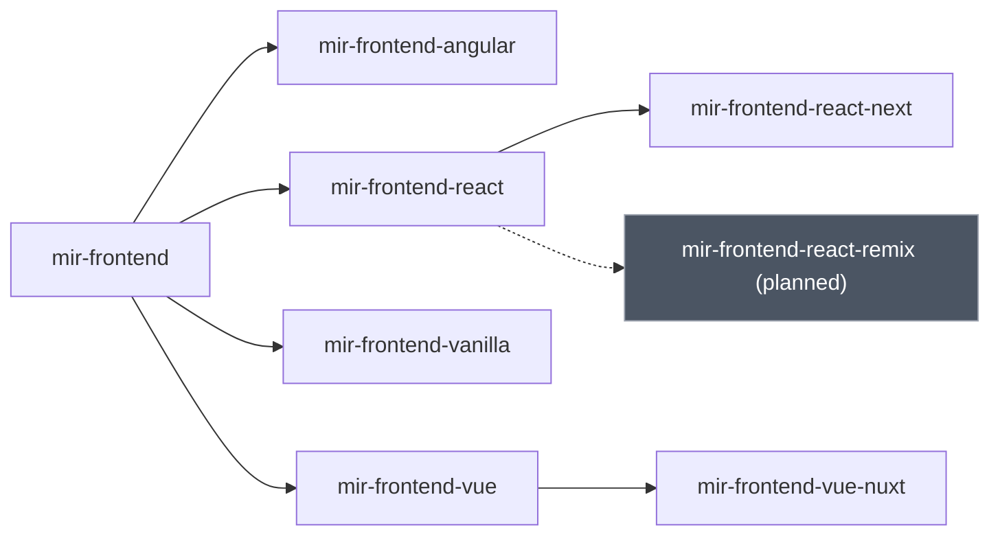

Grey nodes with a dotted edge are listed in `.mir-planned`: referenced by name, deliberately not written yet. They are also marked *(planned)* in the label and in the text version, so the colour is never the only signal.

<details>
<summary>Text version -- The frontend pillar</summary>

- mir-frontend
  - mir-frontend-angular
  - mir-frontend-react
    - mir-frontend-react-next
    - mir-frontend-react-remix -- planned, not written yet
  - mir-frontend-vanilla
  - mir-frontend-vue
    - mir-frontend-vue-nuxt

</details>

<details>
<summary>Links -- The frontend pillar</summary>

- [mir-frontend](../skills/mir-frontend/SKILL.md) -- Web frontend
- [mir-frontend-angular](../skills/mir-frontend-angular/SKILL.md)
- [mir-frontend-react](../skills/mir-frontend-react/SKILL.md) -- React (Vite / SPA, no meta-framework)
- [mir-frontend-react-next](../skills/mir-frontend-react-next/SKILL.md) -- React + Next.js
- `mir-frontend-react-remix` -- planned
- [mir-frontend-vanilla](../skills/mir-frontend-vanilla/SKILL.md) -- No framework (vanilla JS / Web Components)
- [mir-frontend-vue](../skills/mir-frontend-vue/SKILL.md) -- Vue 3
- [mir-frontend-vue-nuxt](../skills/mir-frontend-vue-nuxt/SKILL.md) -- Vue + Nuxt

</details>
<!-- mir:gen:end id=tree-frontend -->

<!-- mir:gen:begin id=tree-mobile src=docs/gen_diagrams.py -->
### The mobile pillar

3 written, 0 listed in `.mir-planned`. Derived from `skills/` on disk, so a new skill appears here the moment its directory does.

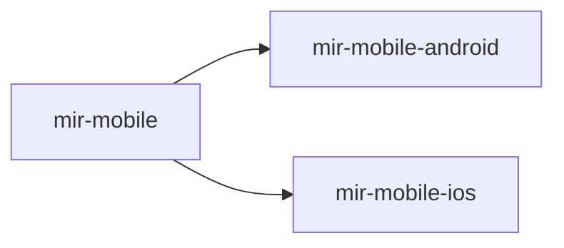

<details>
<summary>Text version -- The mobile pillar</summary>

- mir-mobile
  - mir-mobile-android
  - mir-mobile-ios

</details>

<details>
<summary>Links -- The mobile pillar</summary>

- [mir-mobile](../skills/mir-mobile/SKILL.md) -- Native mobile
- [mir-mobile-android](../skills/mir-mobile-android/SKILL.md) -- Android (Kotlin / Compose)
- [mir-mobile-ios](../skills/mir-mobile-ios/SKILL.md) -- iOS (Swift / SwiftUI)

</details>
<!-- mir:gen:end id=tree-mobile -->

<!-- mir:gen:begin id=tree-database src=docs/gen_diagrams.py -->
### The database pillar

3 written, 0 listed in `.mir-planned`. Derived from `skills/` on disk, so a new skill appears here the moment its directory does.

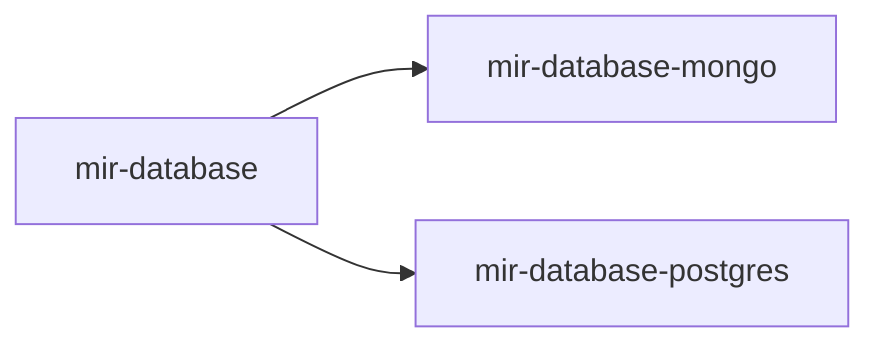

<details>
<summary>Text version -- The database pillar</summary>

- mir-database
  - mir-database-mongo
  - mir-database-postgres

</details>

<details>
<summary>Links -- The database pillar</summary>

- [mir-database](../skills/mir-database/SKILL.md) -- Database
- [mir-database-mongo](../skills/mir-database-mongo/SKILL.md) -- MongoDB
- [mir-database-postgres](../skills/mir-database-postgres/SKILL.md) -- PostgreSQL

</details>
<!-- mir:gen:end id=tree-database -->

<!-- mir:gen:begin id=tree-cloud src=docs/gen_diagrams.py -->
### The cloud pillar

2 written, 3 listed in `.mir-planned`. Derived from `skills/` on disk, so a new skill appears here the moment its directory does.

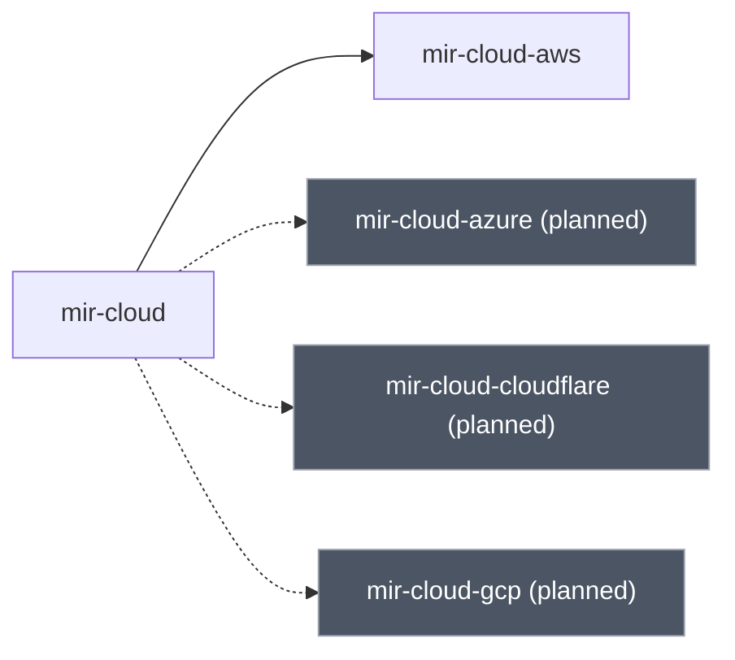

Grey nodes with a dotted edge are listed in `.mir-planned`: referenced by name, deliberately not written yet. They are also marked *(planned)* in the label and in the text version, so the colour is never the only signal.

<details>
<summary>Text version -- The cloud pillar</summary>

- mir-cloud
  - mir-cloud-aws
  - mir-cloud-azure -- planned, not written yet
  - mir-cloud-cloudflare -- planned, not written yet
  - mir-cloud-gcp -- planned, not written yet

</details>

<details>
<summary>Links -- The cloud pillar</summary>

- [mir-cloud](../skills/mir-cloud/SKILL.md) -- Cloud / infra
- [mir-cloud-aws](../skills/mir-cloud-aws/SKILL.md)
- `mir-cloud-azure` -- planned
- `mir-cloud-cloudflare` -- planned
- `mir-cloud-gcp` -- planned

</details>
<!-- mir:gen:end id=tree-cloud -->

<!-- mir:gen:begin id=tree-devsecops src=docs/gen_diagrams.py -->
### The devsecops pillar

1 written, 0 listed in `.mir-planned`. Derived from `skills/` on disk, so a new skill appears here the moment its directory does.

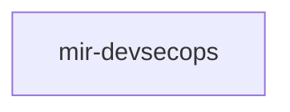

<details>
<summary>Text version -- The devsecops pillar</summary>

1. mir-devsecops

</details>

<details>
<summary>Links -- The devsecops pillar</summary>

- [mir-devsecops](../skills/mir-devsecops/SKILL.md) -- DevSecOps (always on)

</details>
<!-- mir:gen:end id=tree-devsecops -->

<!-- mir:gen:begin id=tree-init src=docs/gen_diagrams.py -->
### The init pillar

1 written, 0 listed in `.mir-planned`. Derived from `skills/` on disk, so a new skill appears here the moment its directory does.

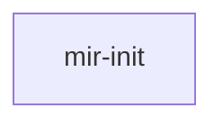

<details>
<summary>Text version -- The init pillar</summary>

1. mir-init

</details>

<details>
<summary>Links -- The init pillar</summary>

- [mir-init](../skills/mir-init/SKILL.md)

</details>
<!-- mir:gen:end id=tree-init -->

---

## Selecting a subtree, and what it installs

`mir init` picks the part of the tree a repo actually needs, then installs the write policy
that the skills assume is in force.

<!-- mir:gen:begin id=init-flow src=docs/gen_diagrams.py -->
### What `mir init` actually does

Detection proposes and never decides, and the run is all-or-nothing: a harness that is half-installed looks installed and enforces nothing.

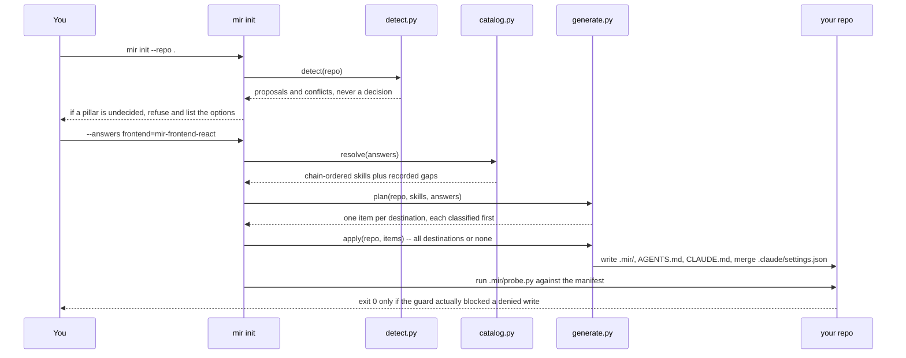

<details>
<summary>Text version -- What `mir init` actually does</summary>

1. You calls mir init (init/cli.py): mir init --repo .
2. mir init (init/cli.py) calls init/detect.py: detect(repo)
3. init/detect.py replies to mir init (init/cli.py): proposals and conflicts, never a decision
4. mir init (init/cli.py) replies to You: if a pillar is undecided, refuse and list the options
5. You calls mir init (init/cli.py): --answers frontend=mir-frontend-react
6. mir init (init/cli.py) calls init/catalog.py: resolve(answers)
7. init/catalog.py replies to mir init (init/cli.py): chain-ordered skills plus recorded gaps
8. mir init (init/cli.py) calls init/generate.py: plan(repo, skills, answers)
9. init/generate.py replies to mir init (init/cli.py): one item per destination, each classified first
10. mir init (init/cli.py) calls init/generate.py: apply(repo, items) -- all destinations or none
11. init/generate.py calls your repository: write .mir/, AGENTS.md, CLAUDE.md, merge .claude/settings.json
12. mir init (init/cli.py) calls your repository: run .mir/probe.py against the manifest
13. your repository replies to You: exit 0 only if the guard actually blocked a denied write

</details>

<details>
<summary>Links -- What `mir init` actually does</summary>

- [init/cli.py](../init/cli.py) -- the flow above, in order
- [init/detect.py](../init/detect.py) -- proposes, never decides
- [init/generate.py](../init/generate.py) -- classifies every destination before writing

</details>
<!-- mir:gen:end id=init-flow -->

<!-- mir:gen:begin id=trust-boundary src=docs/gen_diagrams.py -->
### The write policy, end to end

Deny by default, and denied paths beat allowed roots. The policy, the guard and the probe all live under `.mir/`, which is itself denied, so an agent cannot widen its own permissions.

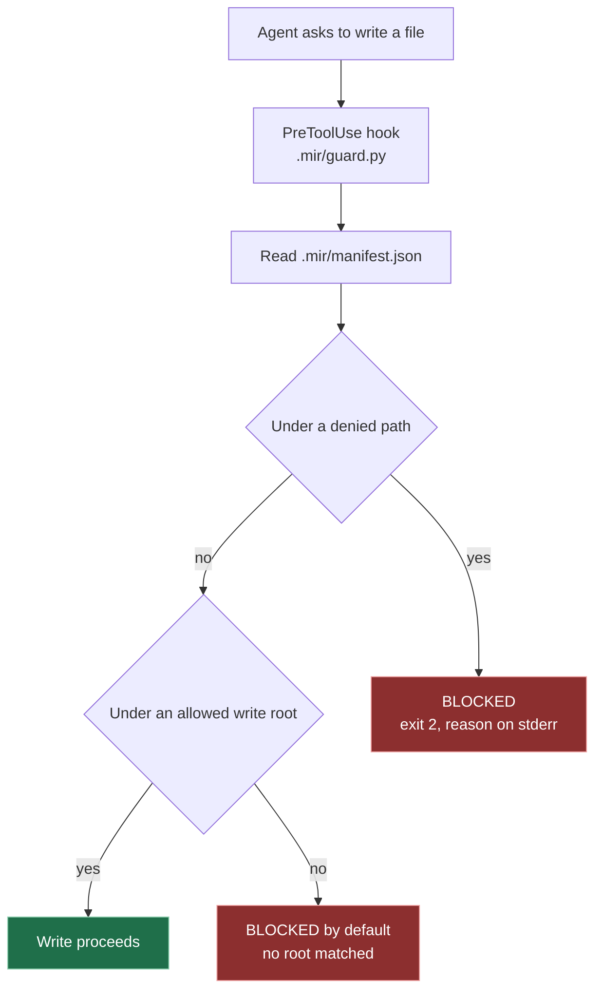

Red nodes are refusals and the green node is the only path that writes. Both outcomes are spelled out in words in the text version.

<details>
<summary>Text version -- The write policy, end to end</summary>

- An agent asks to write a file
  - The PreToolUse hook runs .mir/guard.py
    - The guard reads .mir/manifest.json
      - Is the target under a denied path (secrets, .git, .mir, the hook registration, home config)
        - yes: BLOCKED -- denied paths win over allowed roots
        - no: Is the target under an allowed write root
          - yes: ALLOWED -- the write proceeds
          - no: BLOCKED -- deny by default, nothing outside an allowed root is writable

</details>

<details>
<summary>Links -- The write policy, end to end</summary>

- [init/schema.py](../init/schema.py) -- the baseline denied set, with the reason for each
- [init/guard.py](../init/guard.py) -- the hook that decides
- [init/probe.py](../init/probe.py) -- proves the guard really blocks

</details>
<!-- mir:gen:end id=trust-boundary -->

---

## Adding to the tree

<!-- mir:gen:begin id=placement src=docs/gen_diagrams.py -->
### Where a new skill goes

The name is the chain: `validate.py` reads pillar, tier and module straight out of the hyphens, so putting a skill at the wrong depth breaks it loudly.

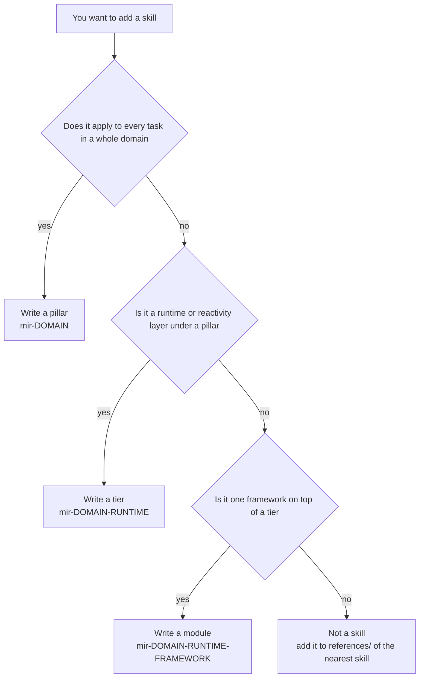

<details>
<summary>Text version -- Where a new skill goes</summary>

- You want to add a skill
  - Does it apply to every task in a whole domain
    - yes: Write a pillar -- mir-DOMAIN
    - no: Is it a runtime or reactivity layer under an existing pillar
      - yes: Write a tier -- mir-DOMAIN-RUNTIME
      - no: Is it one framework on top of an existing tier
        - yes: Write a module -- mir-DOMAIN-RUNTIME-FRAMEWORK
        - no: Not a skill -- add it to references/ of the nearest existing skill

</details>

<details>
<summary>Links -- Where a new skill goes</summary>

- [EXTENDING.md](../EXTENDING.md) -- the naming convention and the size budgets
- [validate.py](../validate.py) -- enforces the chain the name implies

</details>
<!-- mir:gen:end id=placement -->

Read [`EXTENDING.md`](../EXTENDING.md) before writing one: the description is the router,
and a skill whose description has no `TRIGGER` and `SKIP` clause never gets loaded (or
gets loaded over everything).

---

## A note for whoever wires these into the README

Four of these blocks — `gates`, `init-flow`, `trust-boundary`, `placement` — are staged
here because a generated block that lives in no document is a `DIA004` warning: it will
never be seen. When the README pass takes one, **move** it, do not copy it: the same id in
two documents is a `DIA002` error, deliberately, because two copies of a generated block
cannot be kept in sync by anything.

Link paths are rendered relative to the document that carries the block, so after moving a
block run `python3 docs/gen_diagrams.py --write` — a straight copy-paste leaves `../skills/…`
paths that are wrong from the repo root, and `DIA001` will say so.
